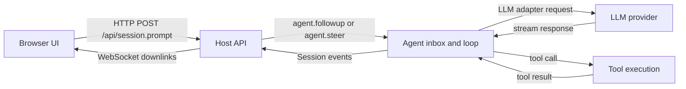
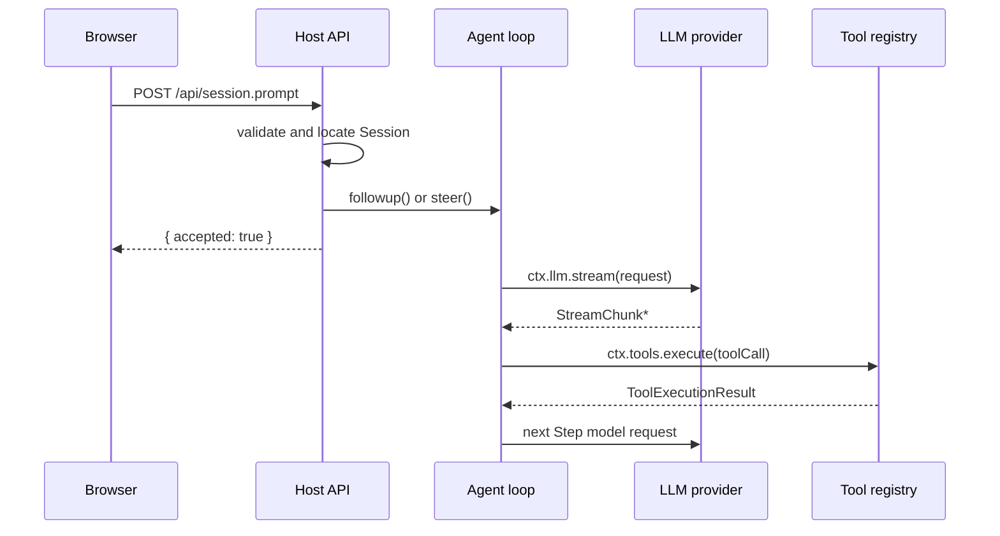
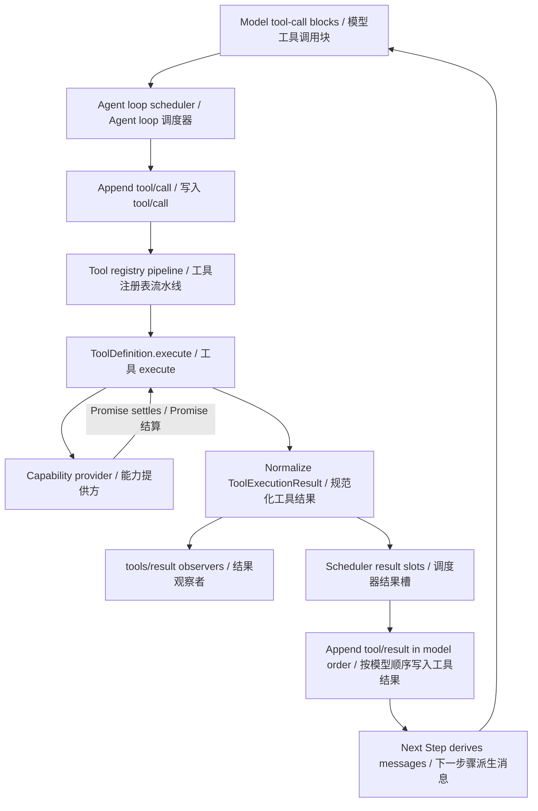

# Web Request Flow and Execution Model

English | [中文](web-request-execution-model.zh.md)

Starting from user needs such as submission feedback, long tasks, streaming display, and reconnect recovery, this page explains why the Web client, Host, and model provider use the current network responsibilities. It also identifies where a request is actually sent and what continues after the browser receives success. See [Web Input State Machine](web-input-state-machine.md) for composer behavior, [From Web Prompt to Agent Reply](web-session-flow.md) for the user-facing task flow, and [API Gateway](api-gateway.md) for Typert Remote declarations and generation.

## 1. Scope

One ordinary message uses two independent classes of upstream network request and continuous downstream event delivery. The browser first submits the message to the Host, the Agent may later request the selected LLM provider, and the Host continuously pushes Session events to the browser. A successful browser request means only that the Host admitted the input; it does not mean that the model request completed.

This page describes the production Web transport implementation between the browser and Host, called a carrier in code. The in-process client reuses the same remote procedure call (RPC) interface, but its Fetch/SSE-compatible path is not the physical network protocol of a browser deployment.

## 2. How user behavior determines the network architecture

The user experiences one continuous action: enter a message, confirm delivery, wait for a reply, observe text and tool progress, and possibly switch pages, refresh, reconnect after an outage, or stop the task. These concrete actions reduce to four shared requirements. The network architecture assigns responsibilities and channels around those requirements instead of designing a separate protocol for each page action.

| Shared requirement | Included user scenarios | Network design choice | User-visible result |
|---|---|---|---|
| Respond promptly and report continuous progress | Confirm delivery soon after Enter; allow models and tool rounds to run for a long time; reveal text and tool state progressively | Submit through a short HTTP request and respond after Host admission; let the Agent continue independently; push Session events through continuous WebSocket downlinks | The composer does not wait for model completion, long tasks do not occupy the submission connection, and the page displays incremental progress. |
| Preserve continuity and consistent state | Switch sessions, refresh, or experience a brief outage; observe concurrent changes from several sessions and global Workspace state | Persist session facts with increasing `seq` values; restore subscriptions and fill gaps after reconnect; carry session events on `/api/events.mux` and Host-wide events on `/api/events.host` | A connection is not the session itself; the page recovers history and in-progress state while routing session and global changes separately. |
| Isolate security-sensitive data and protocol differences | Keep model credentials out of the browser; support provider-specific protocols; prevent arbitrary websites from calling the local Web service cross-site | Let the browser contact only the Host; let Host adapters hold credentials and call providers; validate the source of HTTP requests and WebSocket upgrades before business dispatch | The frontend never receives model keys, the Agent handles providers through one chunk format, and untrusted sites do not reach business processing. |
| Make failure, recovery, and cancellation explicit | Lose a message-submission response; lose a WebSocket connection; stop an active task | Correlate `session.prompt` responses with `rpcId` without automatic retries; reconnect WebSockets and recover by event sequence; cancel the Agent through a separate RPC | An uncertain admission does not cause an implicit duplicate, connection loss can recover, and stopping does not depend on the original submission connection. |

### 2.1 Why request admission, Agent execution, and event delivery are separate

This section turns the shared requirements above into responsibility assignments and provides a reading frame for the end-to-end flow below. It is not a complete sequence of steps, nor does it claim that one task makes only three network exchanges. It explains why the browser cannot use one HTTP request from Enter until the Agent finishes.

| Independent responsibility | What it does | When it ends | What else can happen inside it |
|---|---|---|---|
| Browser request and Host admission | Carries user input, validates the source, request, session, and attachments, and delivers the message to the Agent inbox | The Host returns admission or rejection, or the browser wait ends because of a network error, timeout, or cancellation | Admission only starts or wakes the Agent; it does not wait for a model or tool to finish. If the browser receives no response, whether the Host admitted the input may remain uncertain. |
| Agent execution | Takes the message, advances Turns and Steps, assembles model context, and decides whether to call tools | The current task completes, fails, or is cancelled by the user | It may make no model request or several model requests. Each time the model returns tool calls, the Agent may invoke one or more tools and include their results in the next model request. A tool may wait for network I/O or run in a worker thread or subprocess. |
| Session event delivery | Records user messages, model chunks, tool calls, tool results, and lifecycle changes in the Session and pushes them to the page over WebSocket | The subscription or connection ends; it can span several submissions and Agent Steps | Delivery advances concurrently with Agent execution. After a disconnect it fills gaps by event sequence without requiring the original submission request. |

These responsibilities have different durations and failure modes, so they cannot share one completion state. A successful HTTP submission means only that the Host admitted the message; a later provider or tool failure must not retroactively fail the completed submission. A WebSocket disconnect must not stop the Agent, while stopping a task uses a separate cancellation request instead of closing the original submission connection.

This separation requires `attempt`, `rpcId`, and Session event `seq` to correlate local submission, RPC response, and durable events respectively; section 4 explains their lifetimes. The browser also does not call an LLM provider or tool execution environment directly. Otherwise, model credentials, provider protocol differences, tool processes, and the durable Session would become frontend responsibilities. The Host centralizes admission, origin and attachment checks, Agent scheduling, provider adaptation, tool coordination, and event recording; section 3 explains why different tools use the main thread, asynchronous I/O, worker threads, or subprocesses.

### 2.2 Overall flow of one message

The diagram summarizes only the main roles and data directions for one message. It does not describe specific threads, processes, or deployment locations; section 3 covers those execution details.



The browser first submits the message over HTTP, and the Host delivers an admitted message to the Agent. The Agent may request the model several times and may invoke tools according to model results. The Host continuously returns the resulting Session events to the browser over WebSocket. Tools are an optional branch; without a tool call, the Agent can complete the reply directly.

## 3. Main path: Host admission and Agent-loop execution

One message path has two core executors: the Host receives and validates the browser request, locates the session, and puts the message in the Agent inbox; the Agent loop claims inbox input, builds model requests, consumes model chunks, schedules tools, and feeds tool results into the next model request. Both normally run on the main thread of one Node.js process. Network waits, workers, and subprocesses are mechanisms they call, not a third business executor.

Read this path along two lines. The network line asks which protocols and services carry the message, when admission succeeds, and how events return to the page. The thread line asks where each code segment runs, when it yields the main thread, and which work can block other sessions. A network wait does not create another business thread, and an Agent driver is not an independent thread.

The main path uses five communication channels:

| Direction | Transport | Path | Purpose |
|---|---|---|---|
| Browser → Host | HTTP POST, JSON | `/api/<method>` | Ordinary unary RPC; message submission uses `/api/session.prompt`. |
| Browser → Host | HTTP POST, JSON | `/api/respond` | Answers questions, approvals, and other interactions initiated by the Host. |
| Host → Browser | Downlink-only WebSocket | `/api/events.mux` | Distributes Session events, queues, questions, approvals, and jobs by `SessionId`. |
| Host → Browser | Downlink-only WebSocket | `/api/events.host` | Distributes Host-wide changes such as Workspaces, session lists, and configuration invalidations. |
| Host → LLM provider | Chosen by the provider adapter | Provider endpoint | Sends model context, tool schemas, and controls and receives streaming output. |

HTTP submission, Agent execution, and WebSocket event delivery have different completion conditions. Neither WebSocket carries browser application frames upstream; a connection generation becomes ready only after both sockets open and the `host.describe` HTTP request succeeds.



### 3.1 How WebServer listens and the browser sends a request

The backend listener is provided by [`WebServer[Service.init]()`](../packages/host/webserver/src/index.ts): it creates the `node:http` server at [`index.ts:170`](../packages/host/webserver/src/index.ts) and binds the configured `host` and `port` at [`index.ts:217`](../packages/host/webserver/src/index.ts). The API Proxy does not listen on a port or register Node HTTP routes directly.

After the user presses Enter, the browser follows `SessionInputShell.sinkSerialized()` → `InputHub.defaultSink()` → `ConversationService.sendSession()` → Client `Session.prompt()` to assemble text, images, `sessionId`, submission mode, and time zone. The RPC client's `callUnary('session.prompt')` creates an envelope with an `rpcId`; `postJson()` at [`client.ts:307`](../packages/host/apiproxy/src/fetch/client.ts) ultimately calls browser `fetch()` through `WebApiClient.doFetch()` at [`web-api-client.ts:14`](../packages/client/connection/src/client/web-api-client.ts), sending `POST /api/session.prompt`.

### 3.2 How the HTTP request passes through the bridge into API Proxy

This chain has a startup wiring phase and a request execution phase. At startup, the [`ApiProxyService` constructor:96](../packages/host/apiproxy/src/index.ts) calls `createApiProxy()` and assigns its `sessions` and other business methods to the Cordis service `ctx.apiProxy`. The [`connection` plugin:130](../packages/client/connection/src/index.ts) creates a Fetch handler closure that holds `toFetchHandler`, then registers the `/api` `route.handler` in the `WebServer` route table. No request is processed at this point; the server only saves function objects for later calls.

When a request arrives, `WebServer` retrieves and executes that function object. It does not dynamically locate `handler.ts` by filename. The `connection` module has already imported `toFetchHandler` from `@deepseek-ai/dsh-host-apiproxy`, and the closure obtains the `ctx.apiProxy` instance from the Cordis Context. The continuous call stack for one `session.prompt` is:

```text
WebServer route.handler(req, res)
  -> bridge(req, res, fetchHandler)
  -> fetchHandler.fetch(Request)
  -> toFetchHandler(ctx.apiProxy).fetch(Request)
  -> handleUnary(...)
  -> UNARY_ROUTES['session.prompt'].invoke(...)
  -> ctx.apiProxy.sessions.prompt(...)
  -> agent.followup(...) / agent.steer(...)
  -> ReactLoopAgent.send(...) -> wakeDriver()
```

The objects passed at each hop and their source locations are:

| Call site | Action | Object passed to the next layer |
|---|---|---|
| [`webserver/index.ts:149`](../packages/host/webserver/src/index.ts) | `node:http` receives a request, `match()` finds the `/api` prefix route, and line 155 calls `route.handler(req, res)` | Node `IncomingMessage`, `ServerResponse` |
| [`connection/index.ts:164`](../packages/client/connection/src/index.ts) | The `/api` handler checks request origin and line 170 calls `bridge(req, res, fetchHandler, ...)` | Node HTTP request, shared Fetch handler |
| [`http-bridge.ts:32`](../packages/client/connection/src/http-bridge.ts) | `bridge()` reads the body, line 69 constructs a Fetch `Request`, and line 75 calls `apiHandler.fetch(request)` | Fetch `Request` |
| [`connection/index.ts:140`](../packages/client/connection/src/index.ts) | The shared Fetch handler obtains `ctx.apiProxy` at line 156 and calls `toFetchHandler(apiProxy).fetch(request)` at line 158 | `ApiProxyService` instance, Fetch `Request` |
| [`handler.ts:243`](../packages/host/apiproxy/src/fetch/handler.ts) | `toFetchHandler()` parses `/api/session.prompt`, obtains `session.prompt` at line 302, validates the envelope, and calls `handleUnary()` at line 317 | RPC method, `ClientRequest` |
| [`handler.ts:178`](../packages/host/apiproxy/src/fetch/handler.ts) | `handleUnary()` validates the method payload and calls `route.invoke(api, ...)` at line 187 | `ApiProxyService`, validated RPC request |
| [`handler.ts:99`](../packages/host/apiproxy/src/fetch/handler.ts) | The route's `invoke` executes `api.sessions.prompt(request)` | `session.prompt` request |
| [`api-proxy.ts:2377`](../packages/host/apiproxy/src/api-proxy.ts) | `sessions.prompt()` locates the Agent, persists attachments, creates a `UserMessage`, and calls `agent.steer()` or `agent.followup()` at lines 2414–2415 | `UserMessage` |
| [`agent.ts:113`](../packages/core/agent-loop/src/agent.ts) | `send()` inserts the message into the `next-step` or `next-turn` inbox and calls `wakeDriver()` | Message in the Agent inbox |

The `webserver` therefore does not directly import or call `handler.ts`, `api-proxy.ts`, or `agent.ts`. It only calls the handler saved when the `/api` route was registered. That handler closure holds the Fetch handler, obtains `ctx.apiProxy` from the Cordis Context at runtime, and passes the request through each layer.

The HTTP/Fetch bridge is an in-process interface adapter, not a proxy to another server. Node HTTP uses `IncomingMessage` and `ServerResponse`, while the ApiProxy carrier uses standard Fetch `Request` and `Response`; [`bridge()`](../packages/client/connection/src/http-bridge.ts) converts request bodies, status codes, headers, and streaming response bodies between the two interfaces.

For example, after the browser sends `POST /api/session.prompt`, the Node HTTP handler does not receive an already-parsed JSON object. It receives an `IncomingMessage`: the method is in `req.method`, the path in `req.url`, headers in `req.headers`, and the body must be read from the readable `req` stream. After reading the body, `bridge()` assembles a Fetch `Request`:

```text
const request = new Request(new URL(req.url ?? '/', 'http://dsh.internal'), {
  method: req.method ?? 'GET',
  headers: Object.fromEntries(...),
  body: Buffer.concat(chunks),
  signal: abort.signal,
})
const response = await apiHandler.fetch(request)
```

The carrier can then consistently call `await request.json()` to read the RPC JSON and pass the `Request` to `toFetchHandler()`. After business handling, the bridge writes the Fetch `Response` status, headers, and body chunks to `ServerResponse.writeHead()`, `write()`, and `end()`. This is an in-process object adapter; it does not send another network request.

Before invoking a business method, the Fetch handler validates two JSON layers. The first is the RPC `envelope`: `clientRequestSchema.safeParse()` checks `type`, `rpcId`, `method`, and the outer `payload`. The second is the method-specific `payload`: the route table selects `sessionPromptRequestSchema` for `session.prompt`, which checks business fields such as `sessionId`, `mode`, and `content`. Only after both layers pass does [`handleUnary():178`](../packages/host/apiproxy/src/fetch/handler.ts) call `route.invoke()` and enter the `ApiProxy`; the envelope answers “which method,” while the payload answers “with which arguments.”

### 3.3 How the Host admits the message and delivers it to the Agent

The Host's responsibility ends at admission; it does not wait for model completion. After the browser sends the RPC request to `POST /api/session.prompt`, the Fetch handler checks origin, media type, the JSON envelope, and request fields, then calls `ApiProxy.sessions.prompt()`. That method locates or restores the Agent, checks attachments and model capability, converts the input to a `UserMessage`, and calls `agent.followup()` or `agent.steer()` to write the Agent inbox. The Host then returns `{ accepted: true }`; this response means only that the message entered the Agent's execution queue.

The route table at [`handler.ts:99`](../packages/host/apiproxy/src/fetch/handler.ts) binds `session.prompt` to `api.sessions.prompt`. After envelope and payload validation, [`handleUnary():178`](../packages/host/apiproxy/src/fetch/handler.ts) calls `route.invoke(api, ...)`, which enters Host admission at [`api-proxy.ts:2377`](../packages/host/apiproxy/src/api-proxy.ts).

The `agent` in `api-proxy.ts` is not another RPC client. It is a `ReactLoopAgent` object in the current process. The Agent loop executes `new ReactLoopAgent(...)` at [`agent-loop/index.ts:549`](../packages/core/agent-loop/src/index.ts) and registers that object by `sessionId` through [`AgentRegistry.enter():474`](../packages/core/agent/src/index.ts). While handling a prompt, [`turnAgentFor():1795`](../packages/host/apiproxy/src/api-proxy.ts) uses the shared resolver, which retrieves the same object through `ctx.agents.get(sessionId)` at [`agent-lookup.ts:128`](../packages/api/remotes/src/agent-lookup.ts). If the session is not live in memory, the resolver first resumes and registers its Agent, then returns the resumed object.

Lines 2414–2415 are therefore ordinary JavaScript instance-method calls. `agent.followup(message)` directly executes `this.send(input, 'next-turn', true)` at [`agent.ts:122`](../packages/core/agent-loop/src/agent.ts), while `agent.steer(message)` directly executes `this.send(input, 'next-step', true)` at [`agent.ts:126`](../packages/core/agent-loop/src/agent.ts). In both calls, `this` is the same `ReactLoopAgent` retrieved from the registry, so both enter [`send():113`](../packages/core/agent-loop/src/agent.ts):

```text
api-proxy.ts
  agent.followup(message) -> ReactLoopAgent.followup()
                            -> this.send(message, 'next-turn', true)

  agent.steer(message)    -> ReactLoopAgent.steer()
                            -> this.send(message, 'next-step', true)

agent.ts send()
  -> inbox.splice(...)
  -> wakeDriver()
```

`followup` and `steer` only select `next-turn` or `next-step`; their shared `send()` performs the inbox insertion, and [`agent.ts:172`](../packages/core/agent-loop/src/agent.ts) `wakeDriver()` starts or wakes the one driver. `Agent` is the cross-package interface, while `ReactLoopAgent` is its concrete implementation in `agent.ts`; a TypeScript interface performs no runtime dispatch.

Multiple browser requests do not first enter one global serial queue in the Host. Node.js runs one `toFetchHandler().fetch()` invocation per request. Synchronous JavaScript segments take turns on the main thread, and an `await` yields the event loop so another request can proceed. Admission for different sessions can interleave. Several `session.prompt` requests for one session can also arrive together, but each `followup()` or `steer()` performs one synchronous inbox insertion and never starts a second Agent driver. `queue` messages enter the `next-turn` FIFO, `steer` messages enter `next-step`, and the one driver claims them in Session order.

The order of frontend submissions that appear simultaneous is therefore the order in which the Host processes and inserts them into the inbox, not necessarily the order in which frontend functions were called. The Host returns the response for each request's `rpcId`; the inbox and single Agent driver establish execution order within the session. Host admission ends with the RPC response, whereas Agent-loop execution ends when its Turn/Step completes, fails, or is cancelled.

### 3.4 When the WebSockets are established

A `session.prompt` request does not create the WebSockets, and the browser does not rebuild them for every message. They normally connect when the browser runtime starts and remain alongside later HTTP submissions. This path also has two phases: Host startup prepares the WebSocket acceptor and upgrade routes, while an actual WebSocket connection is created only when the browser performs the handshake.

| Time | Code location | Actual action |
|---|---|---|
| Host plugin composition | [`connection/index.ts:174`](../packages/client/connection/src/index.ts) | Waits for `apiProxy`, creates `WebSocketDownlinks` at line 176, and registers the `/api/events.mux` and `/api/events.host` upgrade routes at lines 193–194. |
| Host acceptor preparation | [`websocket-downlink.ts:52`](../packages/client/connection/src/websocket-downlink.ts) | Creates `WebSocketServer({ noServer: true })`. `noServer` means it opens no separate listening port and reuses the existing `node:http` server. No browser-specific WebSocket exists yet. |
| Browser runtime startup | [`runtime/client/index.ts:204`](../packages/client/runtime/src/client/index.ts) | Calls `connection.start()`; [`connection/client/index.ts:134`](../packages/client/connection/src/client/index.ts) starts the `ConnectionController`. |
| Browser opens both streams | [`connection.ts:128`](../packages/client/connection/src/client/connection.ts) | Iterates `api.events.mux()` and `api.events.host()` concurrently; [`web-api-client.ts:42`](../packages/client/connection/src/client/web-api-client.ts) executes `new WebSocket(ws://.../api/events.mux)` and `new WebSocket(ws://.../api/events.host)`. An HTTPS page uses `wss:`. |
| HTTP upgrades to WebSocket | [`webserver/index.ts:181`](../packages/host/webserver/src/index.ts) | `new WebSocket()` starts a separate connection flow: `ws:` connects to the Host TCP listening port and sends an HTTP Upgrade handshake, while `wss:` completes TLS first. It shares the listening port and `node:http` server with the HTTP API, but does not continue a particular `session.prompt` request. Node then emits `upgrade`, and the Host selects the registered upgrade handler by path. |
| Host completes the handshake | [`websocket-downlink.ts:105`](../packages/client/connection/src/websocket-downlink.ts) | `WebSocketServer.handleUpgrade()` adopts the raw socket as a `ws` `WebSocket`; the actual connection now exists. |
| Bind the event source and pump frames | [`websocket-downlink.ts:64`](../packages/client/connection/src/websocket-downlink.ts) | `handleMux()` or `handleHost()` opens `api.events.mux()` or `api.events.host()`; line 124 continuously reads events and sends JSON frames through `socket.send()`. |

A typical startup sequence is therefore: the page loads and starts its runtime, the browser creates two WebSockets, the Host completes two HTTP upgrades, and the `ConnectionController` reports `connected` after both streams are open and the `host.describe` HTTP request succeeds. Later `session.prompt` calls still travel upstream as independent HTTP POST requests, while model chunks and other Session events travel downstream over the established WebSockets. Both WebSockets are downlink-only; if the browser sends an application frame on either socket, the Host closes it with `1008 downlink only`.

When either WebSocket closes, [`connection.ts:123`](../packages/client/connection/src/client/connection.ts) ends the current connection generation and recreates both sockets after backoff. Reconnection does not resubmit an admitted prompt; Session event `seq` repairs gaps in downstream delivery.

After the browser receives “accepted,” it observes subsequent model chunks, tool state, and terminal results through Session-event WebSocket delivery.

### 3.5 How the Agent loop advances one task

After the Host writes the message to the inbox, one Agent driver advances Turns and Steps. A Step contains at least one model request and all tool calls produced by that request; a Turn may contain several Steps until the model stops, an error or cancellation occurs, or the inbox has no more work.

The main loop is [`agent.ts:210`](../packages/core/agent-loop/src/agent.ts), where `kick()` repeatedly calls `turn()`. `turn()` at [`agent.ts:246`](../packages/core/agent-loop/src/agent.ts) opens `turn/start`, claims inbox input for each Step, assembles the system prompt and tool schemas, and calls `step()`. `step()` at [`agent.ts:332`](../packages/core/agent-loop/src/agent.ts) derives model history from Session and builds the request, then [`agent.ts:346`](../packages/core/agent-loop/src/agent.ts) calls `preparedCall.stream(request)` or `ctx.llm.stream(request)`.

The model response has two branches:

1. With text only, the Agent loop consumes each `StreamChunk`, appends `assistant/chunk`, assembles the complete message, and ends the Step.
2. With tool calls, the Agent loop first records `tool/call`, then passes each call to `ctx.tools.execute()`. After `tool/result` is recorded, the loop derives context from Session and starts the next Step; the model can then see the tool result and decide whether to call another tool or produce final text.

After the model returns tool calls, the Agent loop schedules them, the tool registry owns the execution pipeline, and tools and providers perform the actual work. Every execution mechanism eventually converges on one `ToolExecutionResult`; a provider never bypasses the tool registry to call the Agent loop directly.



1. The Agent loop extracts `tool-call` blocks, appends one `tool/call` Session event per call in model order, and passes the name, parsed arguments, Agent, and cancellation signal to the registry. [`agent.ts:412`](../packages/core/agent-loop/src/agent.ts) → [`tool-calls.ts:59`](../packages/core/agent-loop/src/tool-calls.ts) → [`tool-calls.ts:167`](../packages/core/agent-loop/src/tool-calls.ts).
2. The registry runs `tools/pre-execute`, approval, and guards. A denial or pre-dispatch cancellation produces an error without running the body; an allowed call proceeds through the `tools/execute` waterfall to `ToolDefinition.execute()`. [`tools/index.ts:1463`](../packages/core/tools/src/index.ts) → [`tools/index.ts:1532`](../packages/core/tools/src/index.ts) → [`tools/index.ts:1569`](../packages/core/tools/src/index.ts).
3. The tool's `execute()` waits for its provider. Asynchronous I/O completes through a Promise, a worker returns through a message, and a subprocess completes through its exit and output handles; the tool layer converges these into a fulfilled value or thrown error.
4. A fulfilled value must match the output schema and `output.render()` converts it into model content. Exceptions, invalid output, timeouts, and cancellation become `isError: true` results. [`tools/index.ts:1793`](../packages/core/tools/src/index.ts)
5. `tools/post-execute` may accept, block, or replace the result and attach next-step context; `finalizeContent` applies the final transform. The registry freezes the result and emits synchronous `tools/result`. [`tools/index.ts:1609`](../packages/core/tools/src/index.ts)
6. The scheduler awaits the registry Promise. Results enter slots as they finish, but commits only advance through the contiguous ready prefix in model order. [`tool-calls.ts:145`](../packages/core/agent-loop/src/tool-calls.ts)
7. The Agent loop writes model-visible `content`, `isError`, and presentation metadata as a `tool/result` Session event linked to the earlier `tool/call`; additional context enters `next-step`.
8. When all required results are committed, the Step ends. `Session.deriveMessages()` rebuilds model context containing `tool/result` events, and the next model request lets the model decide whether to call another tool or finish.

This return path is why tool results enter the Session instead of remaining only in a provider callback: the Agent loop's next model request, UI rendering, reconnection, and session recovery all consume the same ordered event stream. See the [tool execution pipeline](tool-execution-pipeline.md) for every policy and hook position.

The important responsibility split is that the Agent loop decides when to request the model, call tools, and start the next Step, while the tool and provider decide which asynchronous I/O, worker, or subprocess mechanism the call uses internally.

`queue` and `steer` only choose the inbox target and never create a second driver: `queue` enters `next-turn`, `steer` enters `next-step`, and the same loop processes both in Session order. Tool parallelism is limited to eligible calls within one Step, and results are eventually committed in model order.

### 3.6 Who decides where a tool runs

Each tool call has two separate decisions: the Agent loop decides whether it may overlap sibling calls, while the tool or provider decides whether the work uses the main thread, asynchronous I/O, a worker thread, or a subprocess. The Agent loop does not inspect CPU intensity or move code to another thread.

Tools are registered through `ctx.tools` and invoked by the Agent loop. Cordis composes plugins, injects capabilities, and manages their lifecycle at startup. The implementation then calls capabilities such as `ctx.web`, `ctx.llm`, or `ctx.shell`; the selected provider chooses the concrete API and execution mechanism. External plugins and MCP tools follow the same tool path. Whether they use Cordis changes how they are loaded, not these thread rules.

Sandboxing applies before the tool body executes, not during HTTP, WebSocket, LLM requests, or Agent-loop scheduling. `ctx.sandboxPolicy` resolves the mode and `workspaceRoot` for one capability call; `ctx.sandbox` wraps the process argv about to be started into a confined argv. `read-only` denies writes, `workspace-write` permits writes only under the workspace and the backend's promised temporary area, and `danger-full-access` bypasses process confinement. These modes govern file effects only, not network access or process visibility. The policy resolver is at [`sandbox-policy/src/index.ts:126`](../packages/sandbox/sandbox-policy/src/index.ts), and the process wrapper is at [`sandbox/src/index.ts:164`](../packages/sandbox/sandbox/src/index.ts).

For a Bash tool, the sequence is: the registry resolves `ToolDefinition` → `bash-sandbox` resolves `sandboxPolicy` → `ctx.sandbox.confine(['bash', '-c', command], policy)` → the returned argv is spawned through `ctx.subprocess`. The sandbox is not another thread; it changes the launch arguments before subprocess creation and the platform backend enforces them. See [`bash-sandbox/src/index.ts:169`](../packages/shell/bash-sandbox/src/index.ts) and [`bash-sandbox/src/index.ts:177`](../packages/shell/bash-sandbox/src/index.ts).

File tools use another enforcement path: `fs-sandbox` re-resolves the target before a write or edit. `read-only` rejects immediately, while `workspace-write` requires the target to remain under an allowed workspace root and otherwise throws `FS_SANDBOX_DENIED`. See [`fs-sandbox/src/index.ts:126`](../packages/fs/fs-sandbox/src/index.ts). The `sandbox/mode` Session event records a session-mode change; it does not enforce isolation itself.

The concepts map to these code entry points. There is no single execution-carrier selector: the Agent loop and tool runtime schedule work, while each provider creates workers, starts asynchronous I/O, or spawns subprocesses.

| Execution mechanism or responsibility | Code entry point | Role |
|---|---|---|
| Agent driver | [`agent.ts:210`](../packages/core/agent-loop/src/agent.ts) | Claims inbox input, advances Turns and Steps, and calls tools and the model. |
| Tool registration and execution | [`tools/src/index.ts:1342`](../packages/core/tools/src/index.ts) | Manages the `ToolDefinition` visible in the current scope, executes tools, and applies concurrency policy. |
| Code Runtime worker | [`code-runtime-worker-thread/src/index.ts`](../packages/code-runtime/code-runtime-worker-thread/src/index.ts) | Creates an independent `worker_threads.Worker` for model-generated JavaScript. |
| Workflow worker | [`workflow-worker-thread/src/host.ts`](../packages/workflow/workflow-worker-thread/src/host.ts) | Creates a worker for workflow scripts and owns message transport and termination. |
| Subprocess provider | [`subprocess-local/src/index.ts`](../packages/subprocess/subprocess-local/src/index.ts) | Creates managed OS subprocesses. Bash and PowerShell providers use it through `ctx.subprocess`. |

One call can combine several mechanisms. For example, a Bash provider validates arguments on the main thread, runs the command in a subprocess, and waits for output through asynchronous I/O. A network provider typically starts the request on the main thread, yields the event loop during asynchronous I/O, and returns to the main thread to process each chunk.

| Execution mechanism | Meaning | Typical work |
|---|---|---|
| Synchronous main-thread segment | JavaScript runs continuously from a callback until it returns, throws, or reaches an unresolved `await`; only one segment runs at a time. | Request validation, writing the Agent inbox, `Session.append()`, processing one model chunk. |
| Asynchronous I/O wait | Network, file, or timer waiting pauses the JavaScript segment; when ready, its continuation returns to the main thread. | Provider requests and stream reads, WebSocket writes, asynchronous file operations. |
| Worker thread | An independent JavaScript thread and V8 isolate that can isolate computation and be terminated. | Long-running Code Runtime or Workflow scripts. |
| Subprocess | An independent operating-system process with its own address space, stdio/PTY, and process-level termination. | Shell, Terminal, ripgrep, and LSP. |

The “main thread” is the Node.js JavaScript thread that runs the Host event loop. HTTP handlers, ordinary Agent drivers, Session, and the WebSocket event bridge normally execute their synchronous segments there. Asynchronous I/O is not another business thread; it lets the main thread run other ready callbacks while external work is pending.

Two sessions can therefore make interleaved progress while waiting for model or file I/O, but their JavaScript segments never run simultaneously. A plugin that computes for five seconds before an `await` blocks requests, model chunks, and WebSocket frames for five seconds. `async execute()` only means that the result is returned as a Promise; the existing Code Runtime and Workflow implementations put long-running JavaScript in workers and external programs in subprocesses, while the runtime does not migrate synchronous code from other plugins automatically.

A Bash call can pass through all three mechanisms: argument validation and result assembly run on the main thread, the command runs in a subprocess, and waiting for exit and output uses asynchronous I/O. This combination, rather than a fixed thread assigned to each tool, is what determines its execution path.

## 4. Boundary between `attempt`, `inflight`, and the network

`attempt` and `inflight` belong to the browser input machine and are not network protocol fields. They cover the interval from Enter through content preparation to the Host admission result. After successful Host admission, `submit-settled` clears `inflight`, and the composer can accept another message. Client Session conversation status, queue state, and events represent whether the Agent remains active.

| Identity | Location | Lifetime | Purpose |
|---|---|---|---|
| `attempt.seq` | Browser input machine | One input submission until `submit-settled` or cancellation | Rejects duplicate submission and late local asynchronous results. |
| `rpcId` | Browser ↔ Host RPC envelope | One RPC request and response | Verifies that the response matches its request; the user-message source also records this id. |
| Session event `seq` | Core `Session` log | Monotonic within one conversation | Orders and deduplicates events, repairs gaps, persists facts, and rebuilds the page. |

These three sequences are not interchangeable. One attempt normally starts one `session.prompt` RPC, while an admitted message produces many Session events for the inbox, Turn, Step, model chunks, and tool work.

## 5. Host admission versus model request

Host admission validates whether the request can enter the system: the session can be located, the time zone is valid, images can become durable, the selected model declares image support, and the Agent inbox accepts the delivery. Success is `{ accepted: true }`.

The Agent driver later claims inbox messages, records `turn/start` and `step/start`, appends the user message to Core `Session`, and assembles the system prompt, message history, tool schemas, and model controls. `Agent.step()` calls `preparedCall.stream(request)` or `ctx.llm.stream(request)`, and the LLM service selects a registered adapter by `provider`.

One admitted message does not imply one provider request. Pre-step rejection can avoid a model call entirely, while tool loops, multiple Steps, and failure retries can produce several provider requests. Each call is assembled independently from the current Agent runtime state and the context recorded by Core `Session`.

The adapter, not the Host API, owns the actual provider network send. For example, the `llm-deepseek` adapter calls `fetch(<baseURL>/chat/completions)` at [`adapter.ts:341`](../packages/llm/llm-deepseek/src/adapter.ts), posts JSON, requests `text/event-stream`, and translates provider SSE into uniform `StreamChunk` values. Other adapters may use a different SDK, endpoint, or streaming protocol, but all expose the same asynchronous chunk stream to the Agent loop through the LLM service.

## 6. Session event model

The Agent and Host API normally run in the same Node.js process. For every uniform chunk, the Agent synchronously appends an `assistant/chunk` event to Core `Session`; complete messages, tool calls, tool results, and Turn/Step boundaries also become events. `Session.append()` assigns a monotonically increasing `seq`, writes the event to the ordered log, and then notifies in-process `session/event` listeners through Cordis.

An ordinary message path emits `turn/*`, `step/*`, `user/message`, `assistant/*`, and `tool/*`; enabled plugins may declaration-merge their own events into `SessionEventMap`. These events are durable Session facts, not a delayed response to the original `session.prompt` HTTP request.

The following tables cover the current [`SessionEventMap` catalog](persistence-catalog.md). Each event name links to its field definition and declaration source; “trigger” states when its backend producer calls `Session.append()`. `surface` events participate in model history, while `log-only` events exist for recovery, audit, or projections. Events owned by a plugin do not occur when that plugin is absent from the composition. This section excludes frontend-local events from the browser input machine, connection state, the DOM, and React state updates.

### 6.1 Main Agent, model, and tool events

| Event | Trigger |
|---|---|
| [`agent/inbox/spliced`](persistence-catalog.md#agentinboxspliced--log-only) | Pending `next-turn` or `next-step` messages are inserted, claimed, removed, or marked cancelled. |
| [`request/context`](persistence-catalog.md#requestcontext--log-only) | The provider route, model, or context capacity for the next model request changes. |
| [`request/header`](persistence-catalog.md#requestheader--log-only) | The Agent has assembled the system prompt, tool schemas, and call configuration inside a Step and is about to dispatch the model request. |
| [`turn/start`](persistence-catalog.md#turnstart--log-only) | The Agent loop opens a Turn, before claiming queued input or running pre-step processing. |
| [`user/message`](persistence-catalog.md#usermessage--surface) | A human prompt, synthetic `agent.inject()` context, or goal continuation enters model-visible history. |
| [`step/start`](persistence-catalog.md#stepstart--log-only) | The Agent opens a Step containing one model call and the tool executions requested by that call. |
| [`assistant/chunk`](persistence-catalog.md#assistantchunk--log-only) | The adapter yields each uniform `StreamChunk`. |
| [`assistant/message`](persistence-catalog.md#assistantmessage--surface) | One Step's chunks form an assembled response; cancellation also closes a visible prefix with `interrupted: true`. |
| [`tool/call`](persistence-catalog.md#toolcall--log-only) | A model response contains a tool-call block that the Agent is about to pass to the tool registry. |
| [`tool/result`](persistence-catalog.md#toolresult--surface) | A tool call succeeds, fails, is denied, times out, or is cancelled and has a final model-visible result. |
| [`tool/code-dispatch-start`](persistence-catalog.md#toolcode-dispatch-start--log-only) | A queued sub-tool inside `run_code` actually enters the execution pipeline; calls abandoned in the queue emit nothing. |
| [`tool/code-dispatch`](persistence-catalog.md#toolcode-dispatch--log-only) | A started `run_code` sub-tool completes, fails, or is cancelled. |
| [`step/end`](persistence-catalog.md#stepend--log-only) | The current Step's model output and all tool results that must be committed have finished processing. |
| [`turn/end`](persistence-catalog.md#turnend--log-only) | An open Turn completes, blocks, fails, is cancelled, reaches its token ceiling, or is marked interrupted during recovery. |
| [`llm/retry`](persistence-catalog.md#llmretry--log-only) | An LLM request attempt fails and the retry plugin schedules another attempt after backoff. |
| [`llm/retry-started`](persistence-catalog.md#llmretry-started--log-only) | The retry wait finishes and the next provider request attempt is about to start. |

### 6.2 Interaction and session-state events

| Event | Trigger |
|---|---|
| [`agent-preset/selected`](persistence-catalog.md#agent-presetselected--log-only) | An Agent preset is selected after creation while the session is still blank. |
| [`approval/asked`](persistence-catalog.md#approvalasked--log-only) | A tool, hook, or another caller submits a question to the approval answerer chain. |
| [`approval/decided`](persistence-catalog.md#approvaldecided--log-only) | The matching approval settles as allowed, denied, cancelled, or unavailable. |
| [`approval/policy`](persistence-catalog.md#approvalpolicy--log-only) | The session approval policy changes or a child Agent receives an override during delegation. |
| [`command/run`](persistence-catalog.md#commandrun--log-only) | A resolved slash command enters its handler. |
| [`command/done`](persistence-catalog.md#commanddone--log-only) | The matching command succeeds, errors, or is cancelled and produces its final outcome. |
| [`feedback/record`](persistence-catalog.md#feedbackrecord--log-only) | A user records one remark about the current session. |
| [`goal/change`](persistence-catalog.md#goalchange--log-only) | A Goal is created, updated, completed, blocked, or cleared and produces a new complete state. |
| [`permission/preset`](persistence-catalog.md#permissionpreset--log-only) | The user selects a permission preset for the session. |
| [`plan/mode`](persistence-catalog.md#planmode--log-only) | The session enters or exits plan mode. |
| [`sandbox/mode`](persistence-catalog.md#sandboxmode--log-only) | The session sandbox mode changes or a child Agent receives an override during delegation. |
| [`schedule/change`](persistence-catalog.md#schedulechange--log-only) | The Schedule plugin accepts a create, delete, or due-dispatch record. |
| [`todo/write`](persistence-catalog.md#todowrite--log-only) | The todo tool replaces the session's todo state with one complete list snapshot. |
| [`session/title`](persistence-catalog.md#sessiontitle--log-only) | A user, command, or title service writes a new session title. |
| [`session/title-llm-request`](persistence-catalog.md#sessiontitle-llm-request--log-only) | The automatic title service is about to send a title-model request. |

### 6.3 Maintenance and extension events

| Event | Trigger |
|---|---|
| [`compaction/start`](persistence-catalog.md#compactionstart--log-only) | Automatic or manual compaction acquires the session compaction lock and begins. |
| [`compaction/summary`](persistence-catalog.md#compactionsummary--log-only) | Summarizing compaction completes its model call and obtains the summary that will replace an older range. |
| [`compaction/prune`](persistence-catalog.md#compactionprune--log-only) | A model-free prune is about to replace an older range with a new surface node. |
| [`compaction/end`](persistence-catalog.md#compactionend--log-only) | Compaction succeeds or fails and releases its lock. |
| [`hook/invoked`](persistence-catalog.md#hookinvoked--log-only) | A Claude or Codex hook bridge starts one handler at a matching hook point. |
| [`hook/result`](persistence-catalog.md#hookresult--log-only) | The matching hook handler exits with a permission, stop, or pass outcome. |
| [`session/end-seed`](persistence-catalog.md#sessionend-seed--log-only) | `Session` construction from a resume, fork, or replay seed marks the boundary between seeded and live events. |
| [`subagent/descriptor`](persistence-catalog.md#subagentdescriptor--log-only) | A session-backed child Agent is established and records its identity and continuation mode before its first model request. |
| [`team/member`](persistence-catalog.md#teammember--log-only) | Experimental Agent Team creates or updates a teammate lifecycle snapshot in the Lead Session. |
| [`team/task`](persistence-catalog.md#teamtask--log-only) | Experimental Agent Team creates or updates a shared-task snapshot in the Lead Session. |
| [`team/message/queued`](persistence-catalog.md#teammessagequeued--log-only) | Experimental Agent Team durably enqueues a teammate message before attempting delivery. |
| [`team/message/delivered`](persistence-catalog.md#teammessagedelivered--log-only) | The target Session has recorded the matching teammate message. |
| [`tool-workflow/run-start`](persistence-catalog.md#tool-workflowrun-start--log-only) | The Workflow tool opens one top-level workflow run. |
| [`tool-workflow/agent-start`](persistence-catalog.md#tool-workflowagent-start--log-only) | A Workflow member Agent is published and starts. |
| [`tool-workflow/agent-end`](persistence-catalog.md#tool-workflowagent-end--log-only) | A Workflow member Agent completes, fails, or is cancelled. |
| [`tool-workflow/run-end`](persistence-catalog.md#tool-workflowrun-end--log-only) | All Workflow members and cleanup finish and the top-level run closes. |
| [`web/deepseek-search-llm-request`](persistence-catalog.md#webdeepseek-search-llm-request--log-only) | The DeepSeek Web Search provider is about to send an auxiliary search-model request. |

## 7. Cancellation, timeout, and reconnect

The browser attempt's `AbortSignal` passes through `sendSession()`, Client `Session.prompt()`, and the RPC client to `fetch()`. Closing a session can therefore cancel reference serialization or a Host admission request still in progress. The configured unary timeout also ends the wait. Cancelling the browser wait is not a Host rollback protocol: if the Host admitted the message but its response was lost, the page may retain the draft even though the message entered the Agent inbox.

`session.prompt` is not retried automatically because resending after an ambiguous admission could duplicate the message. WebSocket loss is handled differently: the connection controller creates a new generation automatically, the Host replays subscription baselines, and Client Session fetches history and fills live gaps by event sequence.

Stopping an active Agent is a separate explicit operation and does not depend on the input attempt. A session cancellation RPC reaches the Host, where the Agent runtime `AbortController` terminates the model stream or tool work.

## 8. Trust and validation points

Every `/api` HTTP request and WebSocket upgrade passes through the same Host trust fence before dispatch. The Host authority must be loopback or a configured trusted host. When `Origin` is present it must match the Host authority, and explicit cross-site Fetch Metadata is rejected. This mechanism limits browser reachability; it is not user authentication, and the current Web carrier provides no authentication layer.

The carrier then requires `application/json` for unary requests and validates the `ClientRequest` envelope, path-method agreement, and method payload. The `session.prompt` business layer additionally validates the time zone, session, attachments, and model capability. Finally, the model adapter owns provider credentials, endpoint requests, HTTP errors, and stream-protocol parsing.

## 9. Typert Remote versus API Proxy

`POST /api/session.prompt` is currently handled by the API Proxy's explicit `RpcMethodMap` and Fetch handler; it is not a Typert Remote method. Typert Gateway and API Proxy share Connection RPC and the `/api` prefix. A registered Typert interceptor claims generated Remote endpoints first, and unclaimed paths fall through to API Proxy.

Therefore, sharing `/api` means only that the mechanisms reuse a carrier, not that their business interfaces are declared the same way. Use [API Gateway](api-gateway.md) when adding an ordinary unary business capability. Incremental protocols such as Session events continue to use dedicated downlink frames rather than Remote method descriptors.

## 10. Code-reading map

| Question | Entry point |
|---|---|
| How does the input effect enter conversation sending? | [`facade.ts:456`](../packages/client/ui-conversation/src/client/input/facade.ts), [`hub.ts:165`](../packages/client/ui-conversation/src/client/input/hub.ts) |
| How do images and text become prompt content? | [`service.ts:145`](../packages/client/ui-conversation/src/client/service.ts) |
| How does Client Session call the RPC? | [`session.ts:190`](../packages/client/runtime/src/client/sessions/session.ts) |
| Where does browser `fetch()` occur? | [`client.ts:307`](../packages/host/apiproxy/src/fetch/client.ts), [`web-api-client.ts:14`](../packages/client/connection/src/client/web-api-client.ts) |
| How does the Host validate and dispatch the path? | [`handler.ts:247`](../packages/host/apiproxy/src/fetch/handler.ts) |
| How does the Host admit a prompt? | [`api-proxy.ts:2377`](../packages/host/apiproxy/src/api-proxy.ts) |
| Where does the Agent claim messages and call the model? | [`agent.ts:122`](../packages/core/agent-loop/src/agent.ts), [`agent.ts:246`](../packages/core/agent-loop/src/agent.ts), [`agent.ts:346`](../packages/core/agent-loop/src/agent.ts) |
| How does one Agent prevent a second driver? | [`agent.ts:172`](../packages/core/agent-loop/src/agent.ts) |
| How are parallel tools bounded and committed in order? | [`tool-calls.ts:131`](../packages/core/agent-loop/src/tool-calls.ts), [`tool-calls.ts:199`](../packages/core/agent-loop/src/tool-calls.ts) |
| Which capabilities create real worker threads? | [`index.ts:378`](../packages/code-runtime/code-runtime-worker-thread/src/index.ts), [`host.ts:149`](../packages/workflow/workflow-worker-thread/src/host.ts) |
| Where does the DeepSeek adapter send the provider request? | [`adapter.ts:341`](../packages/llm/llm-deepseek/src/adapter.ts) |
| How do Session events enter the mux? | [`api-proxy.ts:3343`](../packages/host/apiproxy/src/api-proxy.ts) |
| How does the browser establish and recover both downlinks? | [`connection.ts:107`](../packages/client/connection/src/client/connection.ts) |
