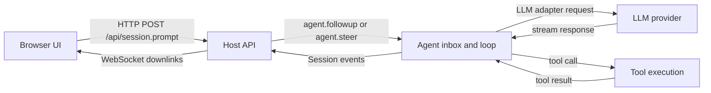
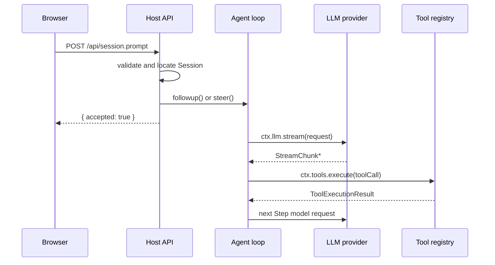
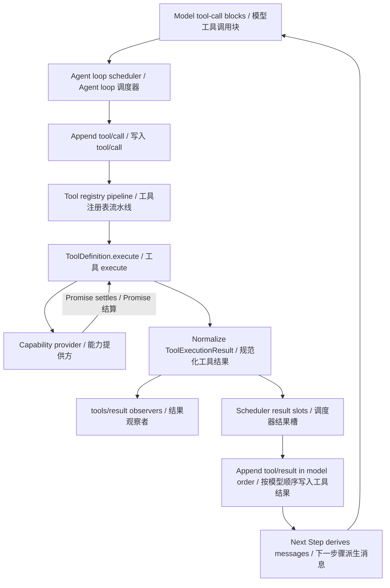

# Web 请求链路与执行模型

[English](web-request-execution-model.md) | 中文

本页从提交反馈、长任务、流式显示和断线恢复等用户需求出发，说明 Web 客户端、Host 和模型提供方为什么采用当前网络分工，并回答“请求在哪一步真正发出”和“浏览器收到成功后系统还会做什么”。页面输入行为见 [Web 输入状态机](web-input-state-machine.zh.md)，用户视角的完整任务流程见[从网页输入到 Agent 回复](web-session-flow.zh.md)，Typert Remote 的声明与生成机制见 [API Gateway](api-gateway.zh.md)。

## 1. 范围

本系统的一次普通消息涉及两类相互独立的上行网络请求和持续的下行事件流：浏览器先向 Host 提交消息，Agent 随后可能向所选 LLM provider 发起模型请求，Host 再把会话事件持续推送给浏览器。浏览器请求成功只表示 Host 已接纳输入，不表示模型请求已经完成。

本页描述生产环境中浏览器与 Host 之间的 Web 传输实现（代码中称为 carrier）。进程内客户端复用相同的 RPC（远程过程调用）接口，但其 Fetch/SSE 兼容路径不是浏览器部署中的物理网络协议。

## 2. 用户行为如何决定网络架构

用户看到的是一次连续操作：输入消息、确认已经送达、等待回复、观察文字和工具进度，必要时切换页面、刷新、断线重连或停止任务。这些具体操作可以归纳为四类共性需求。网络架构针对共性需求划分职责和通道，而不是为每个页面动作单独设计一种协议。

| 共性需求 | 包含的用户场景 | 网络设计选择 | 用户得到的结果 |
|---|---|---|---|
| 及时响应并持续反馈 | 按 Enter 后尽快确认是否送达；模型可能长时间运行或执行多轮工具；文字和工具状态需要逐步出现 | 浏览器使用短 HTTP 请求提交消息，Host 接纳后立即应答；Agent 随后独立执行，Host 通过持续 WebSocket 下行推送 Session events | 输入框不必等待模型完成，长任务不占住提交连接，页面也能增量显示进度。 |
| 连续使用并保持状态一致 | 用户切换会话、刷新页面或短暂断网；多个会话和全局 Workspace 状态同时变化 | 会话事实持久化并带递增 `seq`；重连后恢复订阅并补齐缺口；`/api/events.mux` 承载会话事件，`/api/events.host` 承载 Host 级事件 | 网络连接不等于会话；页面可以恢复历史和进行中状态，会话数据与全局变化各自正确路由。 |
| 隔离安全信息和协议差异 | 模型密钥不能进入浏览器；不同 provider 使用不同协议；本地 Web 服务不能接受任意网页的跨站调用 | 浏览器只访问 Host；Host 的适配器持有凭据并调用 provider；HTTP 和 WebSocket 在业务分派前经过同一 Host 来源校验 | 前端不接触模型密钥，Agent 使用统一分片格式处理不同 provider，不可信网页无法进入业务处理。 |
| 明确处理失败、恢复与取消 | 消息提交应答可能丢失；WebSocket 可能断开；用户可能主动停止任务 | `session.prompt` 使用 `rpcId` 关联应答且不自动重试；WebSocket 自动重连并通过事件序号恢复；停止 Agent 使用独立的取消 RPC | 系统不会因不明确的接纳结果隐式重发消息；断线可以恢复，停止操作也不依赖原提交连接。 |

### 2.1 为什么请求、Agent 执行与事件交付要分开

本节把上一节的共性需求落实为职责划分，并为下面的整体链路图提供阅读框架。它不是完整的顺序步骤，也不是说一次任务只有三次网络通信；它要解释的是，为什么浏览器不能用一次 HTTP 请求从 Enter 一直等待到 Agent 完成。

| 独立职责 | 负责什么 | 何时结束 | 其中还会发生什么 |
|---|---|---|---|
| 浏览器请求与 Host 接纳 | 传递用户输入，校验来源、请求、会话和附件，并把消息交给 Agent inbox | Host 返回接纳或拒绝，或者浏览器等待因网络错误、超时或取消而结束 | 接纳只启动或唤醒 Agent，不等待模型或工具完成；浏览器未收到应答时，Host 是否已经接纳可能无法确定。 |
| Agent 执行 | 领取消息，推进 Turn 和 Step，组装模型上下文并决定是否调用工具 | 当前任务完成、失败或被用户取消 | 可以没有模型请求，也可以有多次模型请求；模型每次返回工具调用后，Agent 可以调用一个或多个工具，再把工具结果送入下一次模型请求。工具可能等待网络，也可能进入 worker thread 或 subprocess。 |
| Session 事件交付 | 把用户消息、模型分片、工具调用、工具结果和生命周期变化记入 Session，并通过 WebSocket 推送给页面 | 订阅或连接结束；它可以跨越多次提交和多个 Agent Step | 事件交付与 Agent 执行同时推进；断线后按事件序号补齐，不要求原提交请求仍然存在。 |

三类职责的时长和失败方式不同，所以它们不能共享一个完成状态。HTTP 提交成功只表示 Host 已接纳消息；之后的 provider 或工具失败不应把已完成的提交改成失败。WebSocket 断开也不应停止 Agent，用户停止任务则通过独立取消请求控制 Agent，而不是关闭最初的提交连接。

这种划分需要使用 `attempt`、`rpcId` 和 Session event `seq` 分别关联本地提交、RPC 应答和持久事件；第 4 节说明这三个标识的生命周期。浏览器也不直接调用 LLM provider 或工具执行环境，否则模型凭据、provider 协议差异、工具进程和持久 Session 都会进入前端职责。Host 统一负责接纳、来源与附件校验、Agent 调度、provider 适配、工具协调和事件记录；第 3 节继续说明不同工具为什么分别使用主线程、异步 I/O、worker thread 或 subprocess。

### 2.2 一次消息的总体链路

下图只概括一次消息涉及的主要角色和数据方向，不表达具体的线程、进程或部署位置；这些执行细节由第 3 节说明。



浏览器先通过 HTTP 提交消息，Host 接纳后把消息交给 Agent。Agent 可以多次请求模型，也可以根据模型结果调用工具；执行过程中产生的 Session events 由 Host 通过 WebSocket 持续送回浏览器。工具是可选分支，没有工具调用时，Agent 可以直接完成回复。

## 3. 主线：Host 接纳与 Agent loop 执行

一次消息路径有两个核心执行者：Host 负责接收并校验浏览器请求、找到会话并把消息放入 Agent inbox；Agent loop 负责从 inbox 领取消息，组装模型请求，消费模型分片，调度工具，并把工具结果交给下一次模型请求。两者通常运行在同一个 Node.js 进程的主线程上；网络等待、worker 和 subprocess 是它们调用的执行机制，不是第三个业务执行者。

阅读这条路径时要同时观察两条线：网络线回答消息经过哪些协议和服务、何时接纳成功以及如何把事件送回页面；线程线回答每段代码在哪个执行载体运行、何时让出主线程以及什么工作会阻塞其他会话。网络等待不等于新建业务线程，Agent driver 也不是独立线程。

这条主线使用五条通信通道：

| 方向 | 传输 | 路径 | 用途 |
|---|---|---|---|
| 浏览器 → Host | HTTP POST，JSON | `/api/<method>` | 普通 unary RPC；消息提交使用 `/api/session.prompt`。 |
| 浏览器 → Host | HTTP POST，JSON | `/api/respond` | 回答 Host 发起的问题或审批等交互。 |
| Host → 浏览器 | 只下行 WebSocket | `/api/events.mux` | 按 `SessionId` 分发会话事件、队列、问题、审批和任务。 |
| Host → 浏览器 | 只下行 WebSocket | `/api/events.host` | 分发 Workspace、会话列表和配置失效等 Host 级变化。 |
| Host → LLM provider | provider adapter 决定 | provider endpoint | 发送模型上下文、工具 schema 和控制参数，接收流式结果。 |

HTTP 提交、Agent 执行和 WebSocket 事件交付具有不同的完成条件。两个 WebSocket 都不承载浏览器应用上行 frame；一次连接代次只有在两个 socket 已打开且 `host.describe` HTTP 请求成功后才进入 ready。



### 3.1 WebServer 如何监听，浏览器如何发出请求

后端对外监听 HTTP 的服务由 [`WebServer[Service.init]()`](../packages/host/webserver/src/index.ts) 提供：它在 [`index.ts:170`](../packages/host/webserver/src/index.ts) 创建 `node:http` server，并在 [`index.ts:217`](../packages/host/webserver/src/index.ts) 绑定配置的 `host` 和 `port`。API Proxy 自身不监听端口，也不直接注册 Node HTTP 路由。

用户按 Enter 后，浏览器沿 `SessionInputShell.sinkSerialized()` → `InputHub.defaultSink()` → `ConversationService.sendSession()` → Client `Session.prompt()` 组装文本、图片、`sessionId`、发送模式和时区。RPC 客户端的 `callUnary('session.prompt')` 创建带 `rpcId` 的 envelope，[`client.ts:307`](../packages/host/apiproxy/src/fetch/client.ts) 的 `postJson()` 最终通过 [`web-api-client.ts:14`](../packages/client/connection/src/client/web-api-client.ts) 的 `WebApiClient.doFetch()` 调用浏览器 `fetch()`，发出 `POST /api/session.prompt`。

### 3.2 HTTP 请求如何经过 bridge 进入 API Proxy

这条链分为启动时接线和请求时执行。启动时，[`ApiProxyService` 构造函数:96](../packages/host/apiproxy/src/index.ts) 调用 `createApiProxy()`，把返回的 `sessions` 等业务方法挂到 Cordis 服务 `ctx.apiProxy`；[`connection` 插件:130](../packages/client/connection/src/index.ts) 创建一个持有 `toFetchHandler` 的 Fetch handler 闭包，再把 `/api` 的 `route.handler` 注册进 `WebServer` 的路由表。此时没有处理任何请求，只是保存了后面要调用的函数对象。

请求到来后，`WebServer` 从路由表取出这个函数对象并执行。这里没有根据文件名动态查找 `handler.ts`；`connection` 模块已经从 `@deepseek-ai/dsh-host-apiproxy` 导入 `toFetchHandler`，闭包再从 Cordis Context 取得 `ctx.apiProxy` 实例。一次 `session.prompt` 的连续调用栈是：

```text
WebServer route.handler(req, res)
  -> bridge(req, res, fetchHandler)
  -> fetchHandler.fetch(Request)
  -> toFetchHandler(ctx.apiProxy).fetch(Request)
  -> handleUnary(...)
  -> UNARY_ROUTES['session.prompt'].invoke(...)
  -> ctx.apiProxy.sessions.prompt(...)
  -> agent.followup(...) / agent.steer(...)
  -> ReactLoopAgent.send(...) -> wakeDriver()
```

各跳传递的对象和源码位置如下：

| 调用位置 | 调用动作 | 传给下一层的对象 |
|---|---|---|
| [`webserver/index.ts:149`](../packages/host/webserver/src/index.ts) | `node:http` 收到请求，`match()` 找到 `/api` 前缀路由，并在第 155 行调用 `route.handler(req, res)` | Node `IncomingMessage`、`ServerResponse` |
| [`connection/index.ts:164`](../packages/client/connection/src/index.ts) | `/api` handler 校验请求来源，在第 170 行调用 `bridge(req, res, fetchHandler, ...)` | Node HTTP 请求、共享 Fetch handler |
| [`http-bridge.ts:32`](../packages/client/connection/src/http-bridge.ts) | `bridge()` 读取请求体，在第 69 行构造 Fetch `Request`，并在第 75 行调用 `apiHandler.fetch(request)` | Fetch `Request` |
| [`connection/index.ts:140`](../packages/client/connection/src/index.ts) | 共享 Fetch handler 在第 156 行取得 `ctx.apiProxy`，在第 158 行调用 `toFetchHandler(apiProxy).fetch(request)` | `ApiProxyService` 实例、Fetch `Request` |
| [`handler.ts:243`](../packages/host/apiproxy/src/fetch/handler.ts) | `toFetchHandler()` 解析 `/api/session.prompt`，在第 302 行得到 `session.prompt`，校验 envelope 后在第 317 行调用 `handleUnary()` | RPC method、`ClientRequest` |
| [`handler.ts:178`](../packages/host/apiproxy/src/fetch/handler.ts) | `handleUnary()` 校验方法 payload，并在第 187 行调用 `route.invoke(api, ...)` | `ApiProxyService`、已校验的 RPC request |
| [`handler.ts:99`](../packages/host/apiproxy/src/fetch/handler.ts) | 路由项的 `invoke` 执行 `api.sessions.prompt(request)` | `session.prompt` request |
| [`api-proxy.ts:2377`](../packages/host/apiproxy/src/api-proxy.ts) | `sessions.prompt()` 定位 Agent、持久化附件并创建 `UserMessage`，在第 2414–2415 行调用 `agent.steer()` 或 `agent.followup()` | `UserMessage` |
| [`agent.ts:113`](../packages/core/agent-loop/src/agent.ts) | `send()` 把消息写入 `next-step` 或 `next-turn` inbox，并调用 `wakeDriver()` | Agent inbox 中的消息 |

因此，`webserver` 不直接 import 或调用 `handler.ts`、`api-proxy.ts`、`agent.ts`。它只调用 `/api` 路由注册时保存的 handler；该 handler 闭包持有 Fetch handler，并在运行时从 Cordis Context 取得 `ctx.apiProxy`，随后逐层转交请求。

这里的 HTTP/Fetch bridge 是同一进程内的接口适配器，不是把请求转发到另一台服务器。Node HTTP 使用 `IncomingMessage` 和 `ServerResponse`，ApiProxy carrier 使用标准 Fetch 的 `Request` 和 `Response`；[`bridge()`](../packages/client/connection/src/http-bridge.ts) 负责在两套类型之间转换请求体、状态码、响应头和流式响应体。

例如，浏览器发送 `POST /api/session.prompt` 后，Node HTTP handler 收到的不是一个已经解析好的 JSON 对象，而是 `IncomingMessage`：方法在 `req.method`，路径在 `req.url`，请求头在 `req.headers`，请求体还要从 `req` 这个可读流中读取。`bridge()` 读取 body 后，将这些字段组装成 Fetch `Request`：

```text
const request = new Request(new URL(req.url ?? '/', 'http://dsh.internal'), {
  method: req.method ?? 'GET',
  headers: Object.fromEntries(...),
  body: Buffer.concat(chunks),
  signal: abort.signal,
})
const response = await apiHandler.fetch(request)
```

后面的 carrier 因此可以统一使用 `await request.json()` 读取 RPC JSON，并把 `Request` 交给 `toFetchHandler()`。业务处理完成后，bridge 将 Fetch `Response` 的 `status`、headers 和 body chunks 写入 `ServerResponse` 的 `writeHead()`、`write()` 和 `end()`；这只是同一进程内的对象适配，不会再次发起网络请求。

Fetch handler 在调用业务方法前执行两层 JSON 校验。第一层是 RPC `envelope`：`clientRequestSchema.safeParse()` 校验 `type`、`rpcId`、`method` 和外层 `payload`；第二层是方法专用的 `payload`：路由表为 `session.prompt` 选择 `sessionPromptRequestSchema`，再校验 `sessionId`、`mode`、`content` 等业务字段。只有 envelope 和 payload 都通过后，[`handleUnary():178`](../packages/host/apiproxy/src/fetch/handler.ts) 才会调用 `route.invoke()` 进入 `ApiProxy`；前者回答“调用哪个方法”，后者回答“这个方法带什么参数”。

### 3.3 Host 如何接纳消息并投递 Agent

Host 的职责止于“接纳”，不负责等待模型完成。浏览器把 RPC 请求发送到 `POST /api/session.prompt` 后，Fetch handler 先执行来源、媒体类型、JSON envelope 和请求参数校验，然后调用 `ApiProxy.sessions.prompt()`。该方法定位或恢复 Agent，检查附件和模型能力，把输入转换为 `UserMessage`，再调用 `agent.followup()` 或 `agent.steer()` 写入 Agent inbox。写入成功后 Host 返回 `{ accepted: true }`；这个应答只表示消息已经进入 Agent 的执行队列。

路由表在 [`handler.ts:99`](../packages/host/apiproxy/src/fetch/handler.ts) 把 `session.prompt` 绑定到 `api.sessions.prompt`；请求经过 envelope 和 payload 校验后，[`handleUnary():178`](../packages/host/apiproxy/src/fetch/handler.ts) 调用 `route.invoke(api, ...)`，这才进入 [`api-proxy.ts:2377`](../packages/host/apiproxy/src/api-proxy.ts) 的 Host 接纳逻辑。

`api-proxy.ts` 中的 `agent` 不是另一个 RPC 客户端，而是当前进程中的 `ReactLoopAgent` 对象。Agent loop 在 [`agent-loop/index.ts:549`](../packages/core/agent-loop/src/index.ts) 执行 `new ReactLoopAgent(...)`，并通过 [`AgentRegistry.enter():474`](../packages/core/agent/src/index.ts) 按 `sessionId` 注册该对象；处理 prompt 时，[`turnAgentFor():1795`](../packages/host/apiproxy/src/api-proxy.ts) 使用共享 resolver，而 resolver 在 [`agent-lookup.ts:128`](../packages/api/remotes/src/agent-lookup.ts) 通过 `ctx.agents.get(sessionId)` 取回同一个对象。如果会话尚未在内存中，resolver 会先恢复并注册 Agent，再返回恢复出的对象。

因此，第 2414–2415 行是普通的 JavaScript 实例方法调用。`agent.followup(message)` 在 [`agent.ts:122`](../packages/core/agent-loop/src/agent.ts) 直接执行 `this.send(input, 'next-turn', true)`；`agent.steer(message)` 在 [`agent.ts:126`](../packages/core/agent-loop/src/agent.ts) 直接执行 `this.send(input, 'next-step', true)`。两者的 `this` 都是刚才从 registry 取出的同一个 `ReactLoopAgent`，所以都会进入 [`send():113`](../packages/core/agent-loop/src/agent.ts)：

```text
api-proxy.ts
  agent.followup(message) -> ReactLoopAgent.followup()
                            -> this.send(message, 'next-turn', true)

  agent.steer(message)    -> ReactLoopAgent.steer()
                            -> this.send(message, 'next-step', true)

agent.ts send()
  -> inbox.splice(...)
  -> wakeDriver()
```

`followup` 与 `steer` 只决定消息进入 `next-turn` 还是 `next-step`；共享的 `send()` 负责真正写 inbox，并由 [`agent.ts:172`](../packages/core/agent-loop/src/agent.ts) 的 `wakeDriver()` 启动或唤醒唯一 driver。这里的 `Agent` 是跨包接口，`ReactLoopAgent` 是 `agent.ts` 中实现该接口的具体类；TypeScript 接口不参与运行时跳转。

多个浏览器请求不会先排进 Host 的全局串行队列。Node.js 为每个请求执行一次 `toFetchHandler().fetch()`；请求的同步 JavaScript 片段在主线程上依次运行，遇到 `await` 后让出事件循环，其他请求可以继续。不同会话的接纳可以交错进行；同一会话的多个 `session.prompt` 也可以同时到达，但每次 `followup()`/`steer()` 都是一次同步的 inbox 写入，不会启动第二个 Agent driver。`queue` 消息按 `next-turn` FIFO 排队，`steer` 消息进入 `next-step`，最终由同一个 driver 按 Session 顺序领取。

前端“同时发送”的先后以 Host 实际处理并写入 inbox 的顺序为准，不以前端调用函数的时间为准。Host 为每个请求分别返回对应 `rpcId` 的应答；inbox 和唯一 Agent driver 保证会话内的执行顺序。Host 的接纳路径以 RPC 应答结束，Agent loop 则在 Turn/Step 完成、失败或取消时结束。

### 3.4 WebSocket 在什么时候建立

WebSocket 不由 `session.prompt` 创建，也不是每发送一条消息就重建一次。它通常在浏览器 runtime 启动时建立，并与后续 HTTP 提交并行存在。这里也有“启动时接线”和“连接时握手”两个阶段：Host 启动时只准备 WebSocket 接收器和 upgrade 路由，浏览器开始连接时才创建实际的 WebSocket 连接。

| 时机 | 代码位置 | 实际动作 |
|---|---|---|
| Host 插件装配 | [`connection/index.ts:174`](../packages/client/connection/src/index.ts) | 等待 `apiProxy` 可用，在第 176 行创建 `WebSocketDownlinks`，再于第 193–194 行注册 `/api/events.mux` 和 `/api/events.host` 两条 upgrade 路由。 |
| Host 准备接收器 | [`websocket-downlink.ts:52`](../packages/client/connection/src/websocket-downlink.ts) | 创建 `WebSocketServer({ noServer: true })`。`noServer` 表示它不另开监听端口，而是复用现有 `node:http` server。此时还没有某个浏览器对应的 WebSocket 连接。 |
| 浏览器 runtime 启动 | [`runtime/client/index.ts:204`](../packages/client/runtime/src/client/index.ts) | 调用 `connection.start()`；[`connection/client/index.ts:134`](../packages/client/connection/src/client/index.ts) 启动 `ConnectionController`。 |
| 浏览器打开两条流 | [`connection.ts:128`](../packages/client/connection/src/client/connection.ts) | 同时迭代 `api.events.mux()` 和 `api.events.host()`；[`web-api-client.ts:42`](../packages/client/connection/src/client/web-api-client.ts) 分别执行 `new WebSocket(ws://.../api/events.mux)` 和 `new WebSocket(ws://.../api/events.host)`。HTTPS 页面使用 `wss:`。 |
| HTTP 升级为 WebSocket | [`webserver/index.ts:181`](../packages/host/webserver/src/index.ts) | `new WebSocket()` 启动独立的建连流程：`ws:` 连接 Host 的 TCP 监听端口后发送 HTTP Upgrade 握手，`wss:` 则先完成 TLS。它与 HTTP API 共用监听端口和 `node:http` server，但不是继续使用某次 `session.prompt` 请求。Node 随后触发 `upgrade` 事件，Host 按路径找到已注册的 upgrade handler。 |
| Host 完成握手 | [`websocket-downlink.ts:105`](../packages/client/connection/src/websocket-downlink.ts) | `WebSocketServer.handleUpgrade()` 把原始 socket 接管为 `ws` 的 `WebSocket` 对象，这时实际连接才建立。 |
| 绑定事件源并持续发送 | [`websocket-downlink.ts:64`](../packages/client/connection/src/websocket-downlink.ts) | `handleMux()`/`handleHost()` 打开 `api.events.mux()` 或 `api.events.host()`；第 124 行持续读取事件，并通过 `socket.send()` 向浏览器发送 JSON frame。 |

因此，一次典型启动顺序是：页面加载并启动 runtime → 浏览器创建两条 WebSocket → Host 完成两次 HTTP Upgrade → 两条流都打开且 `host.describe` HTTP 请求成功 → ConnectionController 报告 `connected`。之后 `session.prompt` 仍通过独立的 HTTP POST 上行，模型分片和其他 Session events 通过已经建立的 WebSocket 下行。两个 WebSocket 都是只下行通道；浏览器若在其上发送业务 frame，Host 会以 `1008 downlink only` 关闭连接。

任一 WebSocket 关闭时，[`connection.ts:123`](../packages/client/connection/src/client/connection.ts) 会终止当前连接代次，经过退避后重新创建两条 WebSocket。重连不会重新提交已经接纳的 prompt；Session event `seq` 用于恢复下行事件缺口。

浏览器收到“已接纳”后，仍通过 Session event WebSocket 观察后续模型分片、工具状态和最终结果。

### 3.5 Agent loop 如何推进一次任务

Host 把消息放入 inbox 后，Agent loop 的唯一 driver 负责推进 Turn 和 Step。一个 Step 至少包含一次模型请求，也包含该请求产生的所有工具调用；一个 Turn 可以连续包含多个 Step，直到模型结束、发生错误、被取消，或 inbox 没有继续工作。

代码中的主循环是 [`agent.ts:210`](../packages/core/agent-loop/src/agent.ts)：`kick()` 反复调用 `turn()`。`turn()` 在 [`agent.ts:246`](../packages/core/agent-loop/src/agent.ts) 打开 `turn/start`，在每个 Step 领取 inbox、组装系统提示词和工具 schema，然后调用 `step()`；`step()` 在 [`agent.ts:332`](../packages/core/agent-loop/src/agent.ts) 从 Session 派生模型历史、构造请求，并在 [`agent.ts:346`](../packages/core/agent-loop/src/agent.ts) 通过 `preparedCall.stream(request)` 或 `ctx.llm.stream(request)` 请求模型。

模型返回的内容有两种分支：

1. 只有文本时，Agent loop 逐个消费 `StreamChunk`，追加 `assistant/chunk`，组装完整消息并结束当前 Step。
2. 包含工具调用时，Agent loop 先记录 `tool/call`，再把调用交给 `ctx.tools.execute()`。工具结果记录为 `tool/result` 后，Agent loop 从 Session 重新派生上下文，开始下一 Step；模型因此能看到工具结果并决定继续调用工具还是生成最终文本。

模型返回工具调用后，Agent loop 负责调度，工具注册表负责执行流水线，工具与提供方负责完成实际工作。不同执行机制最后都汇合为同一种 `ToolExecutionResult`；提供方不会绕过工具注册表直接回调 Agent loop。



1. Agent loop 从模型消息中取出 `tool-call` 块，按模型顺序为每次调用写入 `tool/call` Session event，并把工具名、解析后的参数、Agent 和取消信号交给工具注册表。[`agent.ts:412`](../packages/core/agent-loop/src/agent.ts) → [`tool-calls.ts:59`](../packages/core/agent-loop/src/tool-calls.ts) → [`tool-calls.ts:167`](../packages/core/agent-loop/src/tool-calls.ts)。
2. 工具注册表依次运行 `tools/pre-execute`、审批和守卫。拒绝或调用前取消会直接生成错误结果，不执行工具主体；允许后才通过 `tools/execute` waterfall 调用 `ToolDefinition.execute()`。[`tools/index.ts:1463`](../packages/core/tools/src/index.ts) → [`tools/index.ts:1532`](../packages/core/tools/src/index.ts) → [`tools/index.ts:1569`](../packages/core/tools/src/index.ts)。
3. 工具的 `execute()` 等待其提供方。异步 I/O 通过 Promise 完成，worker 通过消息返回，subprocess 通过退出与输出句柄完成；这些差异在工具层被收敛为 Promise 的成功值或异常。
4. 成功值必须符合工具声明的输出 schema，并由工具的 `output.render()` 转为供模型读取的内容块。异常、无效输出、超时与取消被规范化为 `isError: true` 的结果。[`tools/index.ts:1793`](../packages/core/tools/src/index.ts)。
5. `tools/post-execute` 可以接受、阻止或替换结果，也可以附加下一步骤使用的上下文；随后 `finalizeContent` 执行最后的内容转换。工具注册表冻结最终结果并发出 `tools/result` 同步通知。[`tools/index.ts:1609`](../packages/core/tools/src/index.ts)。
6. 调度器等待工具注册表返回的 Promise。每个完成结果进入对应的 result slot；并行工具可以任意顺序完成，但调度器只从模型顺序中连续就绪的位置开始提交。[`tool-calls.ts:145`](../packages/core/agent-loop/src/tool-calls.ts)。
7. 提交时，Agent loop 把模型可见的 `content`、`isError` 和展示元数据写成 `tool/result` Session event，并关联此前 `tool/call` 的 event sequence。附加上下文进入 `next-step` inbox。
8. 所有应提交的工具结果完成后，当前 Step 结束。Agent loop 通过 `Session.deriveMessages()` 重建包含 `tool/result` 的模型上下文，再发起下一次模型请求；模型据此决定继续调用工具还是结束回答。

这条返回链解释了为什么工具结果必须先进入 Session，而不能只保存在某个 Provider 的回调中：Agent loop 的下一次模型请求、页面展示、断线重连和会话恢复都从同一条有序事件流获得事实。完整的策略与钩子位置见[工具执行流水线](tool-execution-pipeline.zh.md)。

这里需要把握的边界是：Agent loop 决定“何时请求模型、何时调用工具、何时开始下一 Step”，工具和 provider 决定“这次调用内部使用异步 I/O、worker 还是 subprocess”。

同一会话的 `queue` 和 `steer` 只是 inbox 投递位置，不会创建第二个 driver：`queue` 进入 `next-turn`，`steer` 进入 `next-step`，仍由同一个 loop 按 Session 顺序处理。工具并行也只发生在同一 Step 的允许调用之间，结果最终按模型顺序提交。

### 3.6 谁决定工具在哪里执行

一次工具调用有两个独立的决定：Agent loop 决定它能否和同批调用并行，工具或提供方决定实际使用主线程、异步 I/O、worker thread 还是 subprocess。Agent loop 不会分析函数是不是 CPU 密集型，也不会自动把代码搬到其他线程。

工具先通过 `ctx.tools` 注册并由 Agent loop 调用；Cordis 负责在启动时组合插件、注入能力和管理生命周期。工具实现再调用 `ctx.web`、`ctx.llm`、`ctx.shell` 等能力，由被加载的提供方选择具体 API 和执行载体。外部插件和 MCP 工具也沿用这条工具调用链；它们是否使用 Cordis，只影响接入方式，不改变线程规则。

沙箱作用在工具主体执行前，而不是 HTTP、WebSocket、LLM 请求或 Agent loop 调度阶段。`ctx.sandboxPolicy` 为本次能力调用解析模式和 `workspaceRoot`；`ctx.sandbox` 再把即将启动的进程 argv 包装成受限 argv。`read-only` 禁止写入，`workspace-write` 只允许工作区和后端承诺的临时目录，`danger-full-access` 绕过进程约束；这些模式只管文件效果，不管网络或进程可见性。策略服务的解析入口见 [`sandbox-policy/src/index.ts:126`](../packages/sandbox/sandbox-policy/src/index.ts)，进程包装接口见 [`sandbox/src/index.ts:164`](../packages/sandbox/sandbox/src/index.ts)。

以 Bash 工具为例，调用顺序是：工具注册表找到 `ToolDefinition` → `bash-sandbox` 解析 `sandboxPolicy` → `ctx.sandbox.confine(['bash', '-c', command], policy)` → 将返回的 argv 交给 `ctx.subprocess` spawn。也就是说，沙箱不是另一个线程；它是在 subprocess 创建前改变启动参数并由平台后端强制执行。对应实现见 [`bash-sandbox/src/index.ts:169`](../packages/shell/bash-sandbox/src/index.ts) 和 [`bash-sandbox/src/index.ts:177`](../packages/shell/bash-sandbox/src/index.ts)。

文件工具走另一条强制路径：`fs-sandbox` 在写入或编辑前重新解析目标路径；`read-only` 直接拒绝，`workspace-write` 要求目标位于允许的工作区根目录内，否则抛出 `FS_SANDBOX_DENIED`。对应检查见 [`fs-sandbox/src/index.ts:126`](../packages/fs/fs-sandbox/src/index.ts)。`sandbox/mode` Session event 只记录会话模式变化，不执行隔离本身。

这些概念对应的代码入口如下。这里没有一个统一的“执行载体选择器”：Agent loop 和工具运行时负责调度，具体提供方负责创建 worker、发起异步 I/O 或 spawn 子进程。

| 执行机制或职责 | 代码入口 | 作用 |
|---|---|---|
| Agent driver | [`agent.ts:210`](../packages/core/agent-loop/src/agent.ts) | 领取 inbox、推进 Turn/Step，并调用工具和模型。 |
| 工具注册与执行 | [`tools/src/index.ts:1342`](../packages/core/tools/src/index.ts) | 管理当前 scope 可见的 `ToolDefinition`，执行工具并处理并发策略。 |
| Code Runtime worker | [`code-runtime-worker-thread/src/index.ts`](../packages/code-runtime/code-runtime-worker-thread/src/index.ts) | 为模型生成的 JavaScript 创建独立 `worker_threads.Worker`。 |
| Workflow worker | [`workflow-worker-thread/src/host.ts`](../packages/workflow/workflow-worker-thread/src/host.ts) | 为工作流脚本创建 worker，并负责消息通信和终止。 |
| Subprocess provider | [`subprocess-local/src/index.ts`](../packages/subprocess/subprocess-local/src/index.ts) | 创建受管 OS 子进程。Bash 和 PowerShell provider 通过 `ctx.subprocess` 使用它。 |

具体实现还会在同一次调用中组合多种机制。例如 Bash provider 在主线程校验参数，通过 subprocess 执行命令，再用异步 I/O 等待输出；网络 provider 则通常在主线程发起请求，在异步 I/O 等待期间让出事件循环，收到分片后回到主线程处理。

| 执行机制 | 含义 | 典型工作 |
|---|---|---|
| 主线程同步片段 | 一段 JavaScript 从回调开始连续运行，直到返回、抛错或遇到未解决的 `await`；同一时刻只有一个片段运行。 | 校验请求、写入 Agent inbox、`Session.append()`、处理一个模型分片。 |
| 异步 I/O 等待 | 等待网络、文件或 timer；等待期间不执行这段 JavaScript，I/O 就绪后再把回调交回主线程。 | Provider 请求和流式读取、WebSocket 写入、异步文件操作。 |
| worker thread | 独立的 JavaScript 线程和 V8 isolate，可隔离计算并主动终止。 | Code Runtime 或 Workflow 的长时间脚本。 |
| subprocess | 独立的操作系统进程，拥有独立地址空间、stdio/PTY 和进程级终止。 | Shell、Terminal、ripgrep、LSP。 |

“主线程”指运行 Host 事件循环的 Node.js JavaScript 线程。HTTP handler、普通 Agent driver、Session 和 WebSocket 事件桥的同步片段通常都在这里执行；它们属于不同模块，但共享同一个事件循环。异步 I/O 不是一条额外的业务线程：它只是让主线程在等待外部结果时处理其他已就绪的回调。

因此，两个会话可以在等待模型或文件 I/O 时交错推进，但它们的 JavaScript 片段不会同时运行。若某个插件在 `await` 前连续计算五秒，其他会话的请求、模型分片和 WebSocket frame 都要等五秒；`async execute()` 只表示返回 Promise，不能保证不会阻塞主线程。现有 Code Runtime 和 Workflow 实现把长时间 JavaScript 放入 worker，把外部程序交给 subprocess；运行时不会自动迁移其他插件的同步代码。

例如，Bash 工具的参数校验和结果整理在主线程，命令本身在 subprocess 中运行，等待退出和读取输出使用异步 I/O；一次调用可以同时经过三种机制。这个组合关系正是“工具怎样执行”的完整含义，而不是给每种工具预先分配一条固定线程路径。

## 4. `attempt`、`inflight` 与网络的分界

`attempt` 和 `inflight` 属于浏览器输入状态机，不是网络协议字段。它们覆盖“按 Enter、准备内容、等待 Host 接纳结果”这一段；Host 接纳成功并返回后，`submit-settled` 清除 `inflight`，输入框便可接受下一条消息。Agent 是否仍在运行由 Client Session 的会话状态、队列和事件表示。

| 标识 | 所在位置 | 生命周期 | 用途 |
|---|---|---|---|
| `attempt.seq` | 浏览器输入状态机 | 一次输入提交，直到 `submit-settled` 或取消 | 拒绝重复提交和迟到的本地异步结果。 |
| `rpcId` | 浏览器 ↔ Host RPC envelope | 一次 RPC 请求与应答 | 校验应答对应原请求；用户消息来源也记录该 id。 |
| Session event `seq` | Core `Session` 日志 | 一段会话内单调递增 | 排序、去重、缺口修复、持久化和页面重建。 |

三个序号不能互换。一个 attempt 通常触发一个 `session.prompt` RPC，而被接纳的消息会产生多个 Session events，包括 inbox、Turn、Step、模型分片和工具事件。

## 5. Host 接纳与模型请求

Host 接纳阶段验证请求能否进入系统：会话是否可定位、时区是否合法、图片能否持久化、当前模型是否声明支持图片，以及 Agent inbox 是否接受本次投递。成功结果是 `{ accepted: true }`。

Agent driver 随后领取 inbox 消息，记录 `turn/start` 和 `step/start`，把用户消息追加到 Core `Session`，组装系统提示词、历史消息、工具 schema 和模型参数。`Agent.step()` 调用 `preparedCall.stream(request)` 或 `ctx.llm.stream(request)`；LLM service 根据 `provider` 选择已注册 adapter。

一次被接纳的消息不等于一次 provider 请求。预处理拒绝可以使它不调用模型；工具循环、多个 Step 和失败重试则可以产生多次 provider 请求。每次调用都在当前 Agent 运行状态中独立组装，并共享 Core `Session` 记录的上下文。

实际的 provider 网络发送由 adapter 拥有，而不是 Host API。以 `llm-deepseek` adapter 为例，[`adapter.ts:341`](../packages/llm/llm-deepseek/src/adapter.ts) 调用 `fetch(<baseURL>/chat/completions)`，提交 JSON 并请求 `text/event-stream`；随后把 provider SSE 转成统一 `StreamChunk`。其他 adapter 可以使用不同 SDK、endpoint 或流协议，但都通过 LLM service 向 Agent loop 提供统一的异步分片流。

## 6. Session 事件模型

Agent 与 Host API 默认位于同一个 Node.js 进程中。Agent 每收到一个统一分片，就同步向 Core `Session` 追加 `assistant/chunk`；完整消息、工具调用、工具结果和 Turn/Step 边界也各自形成事件。`Session.append()` 为事件分配单调递增的 `seq` 并写入有序日志，然后通过 Cordis 的 `session/event` 通知进程内监听器。

常见消息路径会产生 `turn/*`、`step/*`、`user/message`、`assistant/*` 和 `tool/*`；启用的插件还可以通过 `SessionEventMap` 声明合并追加自己的事件。这些事件是 Session 的持久事实，不是原 `session.prompt` HTTP 请求的延迟响应。

以下是当前 [`SessionEventMap` 完整目录](persistence-catalog.zh.md)。事件名称链接到字段定义和声明源码；“触发条件”说明后端生产方在什么时刻调用 `Session.append()`。`surface` 事件参与模型历史，`log-only` 事件只供恢复、审计或投影使用。某个插件没有装配时，它拥有的事件不会出现。本节不列浏览器输入状态机、连接状态、DOM 事件或 React 状态更新等前端本地事件。

### 6.1 Agent、模型与工具主线事件

| 事件 | 触发条件 |
|---|---|
| [`agent/inbox/spliced`](persistence-catalog.zh.md#agentinboxspliced--log-only) | Agent 的 `next-turn` 或 `next-step` 待处理消息被插入、领取、删除或标记取消时。 |
| [`request/context`](persistence-catalog.zh.md#requestcontext--log-only) | 下一次模型请求使用的 provider 路由、模型或上下文容量发生变化时。 |
| [`request/header`](persistence-catalog.zh.md#requestheader--log-only) | Agent 在 Step 内完成系统提示词、工具 schema 和调用配置组装，即将发送模型请求时。 |
| [`turn/start`](persistence-catalog.zh.md#turnstart--log-only) | Agent loop 打开一个 Turn，在领取排队输入或运行 pre-step 之前。 |
| [`user/message`](persistence-catalog.zh.md#usermessage--surface) | 人类 prompt、`agent.inject()` 合成上下文或 goal continuation 进入模型可见历史时。 |
| [`step/start`](persistence-catalog.zh.md#stepstart--log-only) | Agent 打开一个 Step；该 Step 包含一次模型调用及其要求的工具执行。 |
| [`assistant/chunk`](persistence-catalog.zh.md#assistantchunk--log-only) | Adapter 每产出一个统一 `StreamChunk` 时。 |
| [`assistant/message`](persistence-catalog.zh.md#assistantmessage--surface) | 一个 Step 的模型分片组装成完整回复时；取消时已有可见前缀也会以 `interrupted: true` 收束。 |
| [`tool/call`](persistence-catalog.zh.md#toolcall--log-only) | 模型回复中出现一个工具调用块、Agent 即将把它交给工具注册表时。 |
| [`tool/result`](persistence-catalog.zh.md#toolresult--surface) | 工具调用成功、失败、被拒绝、超时或取消并形成最终模型可见结果时。 |
| [`tool/code-dispatch-start`](persistence-catalog.zh.md#toolcode-dispatch-start--log-only) | `run_code` 内排队的子工具实际进入执行流水线时；排队后未启动的调用不记录。 |
| [`tool/code-dispatch`](persistence-catalog.zh.md#toolcode-dispatch--log-only) | 已启动的 `run_code` 子工具完成、失败或取消时。 |
| [`step/end`](persistence-catalog.zh.md#stepend--log-only) | 当前 Step 的模型输出及需要提交的工具结果全部处理完时。 |
| [`turn/end`](persistence-catalog.zh.md#turnend--log-only) | 已打开的 Turn 完成、阻塞、失败、取消、达到 token 上限或在恢复时被判定中断时。 |
| [`llm/retry`](persistence-catalog.zh.md#llmretry--log-only) | LLM 请求尝试失败，重试插件确定退避并安排下一次尝试时。 |
| [`llm/retry-started`](persistence-catalog.zh.md#llmretry-started--log-only) | 重试等待完成，即将开始下一次 provider 请求尝试时。 |

### 6.2 交互与会话状态事件

| 事件 | 触发条件 |
|---|---|
| [`agent-preset/selected`](persistence-catalog.zh.md#agent-presetselected--log-only) | 空白会话创建后才选择 Agent preset 时。 |
| [`approval/asked`](persistence-catalog.zh.md#approvalasked--log-only) | 工具、hook 或其他调用方向审批 answerer chain 提交问题时。 |
| [`approval/decided`](persistence-catalog.zh.md#approvaldecided--log-only) | 对应审批得到允许、拒绝、取消或 unavailable 结果时。 |
| [`approval/policy`](persistence-catalog.zh.md#approvalpolicy--log-only) | 会话审批策略被切换，或子 Agent 在委派时继承覆盖策略时。 |
| [`command/run`](persistence-catalog.zh.md#commandrun--log-only) | 已解析的斜杠命令进入其 handler 时。 |
| [`command/done`](persistence-catalog.zh.md#commanddone--log-only) | 对应命令成功、报错或取消并形成最终结果时。 |
| [`feedback/record`](persistence-catalog.zh.md#feedbackrecord--log-only) | 用户对当前会话提交一条反馈时。 |
| [`goal/change`](persistence-catalog.zh.md#goalchange--log-only) | Goal 被创建、更新、完成、阻塞或清除，并形成新的完整状态时。 |
| [`permission/preset`](persistence-catalog.zh.md#permissionpreset--log-only) | 用户为会话选择 permission preset 时。 |
| [`plan/mode`](persistence-catalog.zh.md#planmode--log-only) | 会话进入或退出 plan mode 时。 |
| [`sandbox/mode`](persistence-catalog.zh.md#sandboxmode--log-only) | 会话 sandbox mode 被切换，或子 Agent 在委派时继承覆盖模式时。 |
| [`schedule/change`](persistence-catalog.zh.md#schedulechange--log-only) | Schedule 插件接受一项创建、删除或到期 dispatch 记录时。 |
| [`todo/write`](persistence-catalog.zh.md#todowrite--log-only) | todo 工具以一份完整列表替换会话当前 todo 状态时。 |
| [`session/title`](persistence-catalog.zh.md#sessiontitle--log-only) | 会话标题被用户、命令或标题服务写入新值时。 |
| [`session/title-llm-request`](persistence-catalog.zh.md#sessiontitle-llm-request--log-only) | 自动标题服务即将发送一次标题模型请求时。 |

### 6.3 维护与扩展能力事件

| 事件 | 触发条件 |
|---|---|
| [`compaction/start`](persistence-catalog.zh.md#compactionstart--log-only) | 自动或手动压缩取得会话压缩锁并开始一次压缩时。 |
| [`compaction/summary`](persistence-catalog.zh.md#compactionsummary--log-only) | 摘要压缩完成模型调用并得到将替换旧范围的摘要时。 |
| [`compaction/prune`](persistence-catalog.zh.md#compactionprune--log-only) | 无模型 prune 即将用新 surface 节点替换旧范围时。 |
| [`compaction/end`](persistence-catalog.zh.md#compactionend--log-only) | 压缩成功或失败并释放压缩锁时。 |
| [`hook/invoked`](persistence-catalog.zh.md#hookinvoked--log-only) | Claude 或 Codex hook bridge 在匹配的 hook point 启动一个 handler 时。 |
| [`hook/result`](persistence-catalog.zh.md#hookresult--log-only) | 对应 hook handler 退出并得到 permission、stop 或 pass 结果时。 |
| [`session/end-seed`](persistence-catalog.zh.md#sessionend-seed--log-only) | `Session` 从恢复、fork 或 replay seed 构造完成，需要标记 seed 与本次 live 事件分界时。 |
| [`subagent/descriptor`](persistence-catalog.zh.md#subagentdescriptor--log-only) | session-backed 子 Agent 建立后，在第一次模型请求前记录其身份和续接方式时。 |
| [`team/member`](persistence-catalog.zh.md#teammember--log-only) | 实验性 Agent Team 在 Lead Session 中创建或更新 teammate 生命周期快照时。 |
| [`team/task`](persistence-catalog.zh.md#teamtask--log-only) | 实验性 Agent Team 在 Lead Session 中创建或更新共享任务快照时。 |
| [`team/message/queued`](persistence-catalog.zh.md#teammessagequeued--log-only) | 实验性 Agent Team 在尝试投递前把一条 teammate 消息持久化到 mailbox 时。 |
| [`team/message/delivered`](persistence-catalog.zh.md#teammessagedelivered--log-only) | 目标 Session 已记录对应 teammate 消息时。 |
| [`tool-workflow/run-start`](persistence-catalog.zh.md#tool-workflowrun-start--log-only) | Workflow 工具打开一个顶层 workflow run 时。 |
| [`tool-workflow/agent-start`](persistence-catalog.zh.md#tool-workflowagent-start--log-only) | Workflow 发布并启动一个成员 Agent 时。 |
| [`tool-workflow/agent-end`](persistence-catalog.zh.md#tool-workflowagent-end--log-only) | Workflow 成员 Agent 完成、失败或取消时。 |
| [`tool-workflow/run-end`](persistence-catalog.zh.md#tool-workflowrun-end--log-only) | Workflow 的所有成员和清理工作结束，顶层 run 收束时。 |
| [`web/deepseek-search-llm-request`](persistence-catalog.zh.md#webdeepseek-search-llm-request--log-only) | DeepSeek Web Search provider 即将发送一次辅助搜索模型请求时。 |

## 7. 取消、超时与重连

浏览器 attempt 的 `AbortSignal` 会经过 `sendSession()`、Client `Session.prompt()` 和 RPC 客户端传给 `fetch()`；关闭会话可以取消仍在进行的引用序列化或 Host admission 请求。客户端 unary timeout 也会终止等待。取消浏览器等待不构成 Host 回滚协议：如果 Host 已经接纳消息但应答在网络中丢失，页面可能保留草稿，而消息仍可能进入 Agent inbox。

`session.prompt` 不做自动重试，因为在接纳结果不明确时重发可能产生重复消息。WebSocket 断线则由连接控制器自动建立新的连接代次；Host 重放订阅基线，Client Session 拉取历史并按事件序号补齐实时缺口。

停止正在运行的 Agent 是另一项明确操作，不依赖输入 attempt。它通过会话取消 RPC 到达 Host，再由 Agent 的运行时 `AbortController` 终止模型流或工具工作。

## 8. 信任与校验位置

所有 `/api` HTTP 请求和 WebSocket upgrade 在分派前经过同一 Host trust fence。Host authority 必须是 loopback 或配置的 trusted host；存在 `Origin` 时必须与 Host authority 一致，明确的 cross-site Fetch Metadata 会被拒绝。该机制限制浏览器可达来源，不是用户认证；当前 Web carrier 不提供认证层。

carrier 随后要求 unary 请求使用 `application/json`，校验 `ClientRequest` envelope、路径与 method 一致性以及 method payload。`session.prompt` 业务层再校验时区、会话、附件和模型能力。模型 adapter 最后负责 provider 凭据、endpoint 请求、HTTP 错误和流协议解析。

## 9. Typert Remote 与 API Proxy

`POST /api/session.prompt` 当前由 API Proxy 的显式 `RpcMethodMap` 和 Fetch handler 处理，不是 Typert Remote method。Typert Gateway 与 API Proxy 共用 Connection RPC 和 `/api` 前缀；Host 上注册的 Typert interceptor 会先认领生成的 Remote endpoint，未认领的路径再落到 API Proxy。

因此，“都通过 `/api`”只说明它们复用 carrier，不说明业务接口由同一机制声明。新增普通 unary 业务能力时参考 [API Gateway](api-gateway.zh.md)；会话事件等增量协议仍使用专门的下行 frame，不使用 Remote method descriptor。

## 10. 代码阅读地图

| 问题 | 阅读入口 |
|---|---|
| 输入副作用怎样进入会话发送？ | [`facade.ts:456`](../packages/client/ui-conversation/src/client/input/facade.ts)、[`hub.ts:165`](../packages/client/ui-conversation/src/client/input/hub.ts) |
| 图片和文本怎样组成 prompt content？ | [`service.ts:145`](../packages/client/ui-conversation/src/client/service.ts) |
| Client Session 怎样调用 RPC？ | [`session.ts:190`](../packages/client/runtime/src/client/sessions/session.ts) |
| 浏览器 `fetch()` 在哪里发生？ | [`client.ts:307`](../packages/host/apiproxy/src/fetch/client.ts)、[`web-api-client.ts:14`](../packages/client/connection/src/client/web-api-client.ts) |
| Host 怎样校验并分派路径？ | [`handler.ts:247`](../packages/host/apiproxy/src/fetch/handler.ts) |
| Host 怎样接纳 prompt？ | [`api-proxy.ts:2377`](../packages/host/apiproxy/src/api-proxy.ts) |
| Agent 在哪里领取消息并调用模型？ | [`agent.ts:122`](../packages/core/agent-loop/src/agent.ts)、[`agent.ts:246`](../packages/core/agent-loop/src/agent.ts)、[`agent.ts:346`](../packages/core/agent-loop/src/agent.ts) |
| 同一 Agent 怎样阻止第二个 driver？ | [`agent.ts:172`](../packages/core/agent-loop/src/agent.ts) |
| 工具调用怎样限制并行数并保持提交顺序？ | [`tool-calls.ts:131`](../packages/core/agent-loop/src/tool-calls.ts)、[`tool-calls.ts:199`](../packages/core/agent-loop/src/tool-calls.ts) |
| 哪些能力创建真正的 worker thread？ | [`index.ts:378`](../packages/code-runtime/code-runtime-worker-thread/src/index.ts)、[`host.ts:149`](../packages/workflow/workflow-worker-thread/src/host.ts) |
| DeepSeek adapter 在哪里发出 provider 请求？ | [`adapter.ts:341`](../packages/llm/llm-deepseek/src/adapter.ts) |
| Session events 怎样进入 mux？ | [`api-proxy.ts:3343`](../packages/host/apiproxy/src/api-proxy.ts) |
| 浏览器怎样建立和恢复两条下行流？ | [`connection.ts:107`](../packages/client/connection/src/client/connection.ts) |
