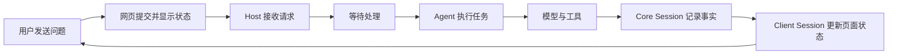

# From Web Prompt to Agent Reply

English | [中文](web-session-flow.zh.md)

After a user types "analyze this project" in the Web page and clicks Send, the desired experience is simple: the message is delivered; it is not lost while the system is busy; progress becomes visible; reading files or running commands remains part of the same task; and refreshing the page preserves the conversation.

This page explains the complete flow from those user needs before introducing code names and entry points. On a first reading, follow only "what the user sees" and "how the system guarantees it." When reading code, return to the "Name in code" paragraph at the end of each section. See [architecture.md](architecture.md) for the plugin model and package map, and [Sessions](subsystems/session.md) and the [Agent lifecycle](agent-lifecycle.md) for exact event semantics.

## Follow the complete user experience first

1. The user enters a question and clicks Send. The composer clears after a successful submission; after a failure, the page shows an error and retains the input.
2. The system accepts the message. If the previous task is still running, the new message waits and the page shows that it is queued.
3. The system starts processing the message. The page adds it to the formal conversation and shows that the task is running.
4. Reply text appears progressively. When the system reads files, runs commands, or uses another Tool, the page shows the corresponding state.
5. After a Tool returns, analysis may continue until the final reply is ready. Several analysis and Tool operations still appear as one user task.
6. The page keeps receiving conversation changes. After a brief disconnect, it reconnects and fills any missing content.
7. On refresh, the system restores the conversation from saved records, and the user returns to the same history.

## From needs to objects: separate states with different properties

Technical modeling does not begin by inventing names such as `Session` and Agent and then fitting requirements into them. It first identifies the properties of each kind of state and then selects an owner:

| State to retain | Key requirement | Modeled as |
|---|---|---|
| Input not yet sent or rejected | Belongs only to the current browser and must not overwrite newer edits | Input state machine |
| Messages accepted but not yet executed | Ordered and still editable, cancellable, or movable into current work | Agent inbox |
| Work currently executing | Cancellable and possibly waiting on a model, Tool, or user; the object itself need not survive a process | Agent |
| One task as the user sees it | Unified start, completion, failure, and cancellation | Turn |
| One model processing | One request, streaming output, Tool calls, and usage | Step |
| Conversation facts that occurred | Ordered, recoverable, and the sole source of model history | Core `Session` event log |
| Content currently displayed by the page | Rebuildable and limited to the current window and interactions | Client `Session` |
| Coordination across many conversations and services | Networking, routing, permissions, Workspaces, and reconnects | Host |

These objects are divided by lifecycle, authority, and cardinality rather than by the number of source files. A draft lives only in the browser; an Agent executes only in the current process; facts in Core `Session` must be recoverable; and one Host coordinates many Sessions.

The following sections explain how each need produces these objects and their behavior.

## Need 1: know whether the message was delivered

When the user clicks Send, the page submits the input. The composer clears only after a successful submission. If submission fails, a short-lived error appears above the composer, such as "model unavailable" or "connection failed," and the original input remains available for editing and resubmission.

While the request is pending, the current page makes the composer read-only and keeps the submitted text visible. The state machine also rejects stale asynchronous results from older attempts, so another event cannot be overwritten by a late settlement.

Successful submission means that the system accepted the message; it does not mean that the model has started answering. The system may still be handling an earlier task, so the page must distinguish "accepted" from "started."

Technical model: the input state machine, Client `Session`, and Host jointly satisfy this need.

- The input state machine holds the draft, attachments, edit metadata, and submission phase. It clears submitted content after success, retains the draft after failure, and prevents a late result from an older attempt from overwriting newer state.
- Client `Session` calls `session.prompt` and stores the most recent send or stop error for the page to display.
- Host validates the request and returns either "accepted" or an explicit error. Each submission's `rpcId` is only a tracking identifier connecting the later formal record to this Web submission.

## Need 2: do not lose follow-up messages while busy

The user may send more information before the current reply finishes. The system first places these messages in an ordered waiting area. At a suitable processing point, the executor takes a batch and starts work.

A waiting message is therefore different from conversation history. It may still be adjusted or cancelled. Only after processing starts does it become a fact that occurred in the conversation.

Technical model: this need primarily produces the Agent and inbox objects.

- The inbox stores a stable identity, content, source, and target placement for each pending message while preserving order.
- `followup()` queues a message for the next task; `steer()` places an instruction at the next point of the current task that can accept it; `inject()` adds context without waking execution by itself.
- Queued messages may be edited, removed, cancelled, or converted to steering. Each change produces a queue snapshot for the page.
- At the start of a Turn or between Steps, the Agent calls `claim` to take the messages belonging to that processing boundary. Only then are they written into the formal conversation record.

| Page state | User interpretation |
|---|---|
| Accepted | The message is safely waiting |
| Started | The executor has taken the message and started the task |

## Need 3: one task may require several rounds of model analysis

The user submits one task, such as "analyze this project." The system may first ask the model which files to inspect, return the file contents to the model, and only then produce a conclusion.

The page still presents the whole operation as one task with a unified running, completed, failed, or cancelled state. Several internal model operations do not become several user tasks.

Technical model: this need produces Turn and Step work units. They are not independent conversations or separately stored business objects; they are ordered ranges in the Core `Session` event log.

- Turn owns the overall state of one user task: started, running, completed, failed, output-limited, or cancelled.
- Step owns one model processing: claiming its input, assembling the request, receiving streaming output, handling Tool calls, and recording usage.
- Agent holds the live state and cancellation signal for the current Turn and decides whether to start another Step or end the Turn.
- The page can use Turn to show whether the task is running without presenting each Step as another task.

## Need 4: Tool use must remain part of the conversation

The model can request work, but reading files, running commands, and reaching other capabilities require Tools. The system records when a Tool starts, its arguments, and its result, then gives that result back to the model so analysis can continue.

For example, project analysis may proceed as follows:

1. The model decides which files it needs.
2. A Tool reads the project contents.
3. The model produces a conclusion from the Tool results.

The page shows Tool state and the reply within the same task. If a Tool requires user approval, the task pauses; after the decision, the original task continues instead of starting a new conversation.

Technical model: Tools are an independent capability used by the Agent loop rather than a branch built into Session or Agent.

- A Step recognizes Tool requests in model output and resolves their implementations through the Tool registry.
- The Tool execution pipeline performs argument, permission, and policy checks and decides whether to execute, reject, or wait for user approval.
- `tool/call` records the invocation before execution and `tool/result` records success or failure. Parallel-safe calls may overlap, while exclusive calls form execution barriers.
- Agent decides from the Tool results whether another Step is needed. Approval or question waits keep the current Step pending, and stable identifiers let the page respond after reconnecting.

## Need 5: show the reply progressively and preserve order

As soon as the model produces a small piece of text, the page should display it instead of waiting for the complete answer. Tool start, Tool completion, and task completion must also appear in occurrence order.

The executor does not manipulate the Web page directly. Whenever something happens, the server first appends it to one ordered record, then pushes the new entry to the browser. The browser receives entries by number, removes duplicates, and turns them into messages, Tool cards, and running states.

The next model input, the visible page history, and history recovered after refresh therefore derive from one record rather than maintaining conflicting copies.

See [Web Trajectory View](web-trajectory-view.md) for how these records become Turns, Requests, Assistants, Tools, and time intervals, and how the timeline, search, folding, and inspector are implemented.

Technical model: this need produces Core `Session`, the event bridge, and Client `Session` as three layers.

- Core `Session` assigns an increasing sequence number to every event, stores user messages, model chunks, final replies, Tool activity, and Turn/Step boundaries, and derives the next model request's message history from those events.
- Host subscribes to new events and relays them to browser connections. It performs forwarding and access control without reinterpreting the conversation.
- Client `Session` holds one contiguous history window, supports loading older pages, deduplicates by sequence number, and repairs gaps after reconnecting. It also maintains queue, pending approval/question, and other page projections.
- `ConversationNodeAssembler` folds events into messages, Tool cards, and status nodes. React renders those nodes rather than reading Agent internals.

## Need 6: return to the same conversation after refresh or disconnect

The browser holds only what the current page needs, so a refresh may discard and rebuild it. After reconnecting, the page first fetches recent history and then resumes live updates. Event numbers fill gaps caused by a brief disconnect.

The server retains the facts that occurred in the conversation. Recovery rebuilds the conversation from those facts and creates a new executor. The user remains in the same conversation identity even though page state and the executor may change.

Technical model: recovery depends on four objects with different lifecycles.

- `SessionId` is the conversation identity and remains unchanged across refresh, disconnect, and process restart.
- Persistence plugins observe Core `Session` events and write them at flush checkpoints; Core `Session` is not tied to a particular database.
- During recovery, SessionStore rebuilds Core `Session` from stored events, then the Agent factory creates a new Agent for the same `SessionId`.
- Client `Session` fetches the most recent history page and then receives live events. The connection controller isolates old connections with a new generation and repairs gaps from event sequence numbers.

## Follow the whole path again

After the user needs are clear, one message maps to the system roles as follows:

| What the user cares about | Responsible part |
|---|---|
| Input, messages, and Tool cards | Conversation UI |
| History, queue, and pending actions needed by the page | Client `Session` |
| Accepting Web requests and locating the conversation | Host |
| Retaining recoverable conversation facts | Core `Session` |
| Driving current work | Agent |
| Generating content or performing concrete operations | Model and Tools |

## Object responsibility cards

The following sections collect the concrete functions inside each modeled object. This is the responsibility set needed by the main path on this page, not a replacement for each subsystem's complete API reference.

### Input state machine

- Holds text drafts, attachments, reference marks, edit metadata, and submission phase.
- Distinguishes ordinary messages, `/` commands, and other input triggers.
- Prevents the same submission attempt from settling twice.
- After success, clears committed content and rejects stale asynchronous settlement from an older attempt.
- After failure, retains the draft and produces a page error notice.

See [Web Input State Machine](web-input-state-machine.md) for the user requirements, state transitions, abstraction layers, failure behavior, and exact source locations. The machine receives edit selections from the textarea; the DOM caret itself remains UI-owned.

### Client Session

- Holds one contiguous history window and its starting event sequence for the open conversation.
- Loads older history and appends live events to the window tail.
- Deduplicates events, detects gaps, and repairs them after reconnecting.
- Stores page state for the Agent queue.
- Stores pending approvals, questions, and background-task state.
- Exposes send, stop, pagination, queue mutation, and attachment-reading operations.
- Provides subscribable page snapshots to Conversation UI.

Client `Session` does not store the complete authoritative history or execute the model and Tools.

### Host

- Provides HTTP request entry points and WebSocket event downlinks.
- Locates or resumes the Session and Agent for a `SessionId`.
- Validates request origin, conversation visibility, attachments, model capability, and required configuration.
- Coordinates Workspaces, session lists, Agent presets, settings, credentials, directory picking, and other services.
- Converts Session, Agent, and capability changes into client events.
- Supplies conversation, queue, and pending-interaction baselines when the browser reconnects.

Host does not own conversation facts or run the model loop.

See [Web Request Flow and Execution Model](web-request-execution-model.md) for the exact boundaries among browser HTTP requests, WebSocket downlinks, Host admission, and model-provider requests.

### Core Session

- Holds `SessionId`, creation metadata, and the append-only event log.
- Assigns strictly increasing sequence numbers and freezes accepted data.
- Records Turns, Steps, user messages, model output, and Tool activity.
- Derives model-visible message history from the event log.
- Exposes readonly event views, the surface projection, and history prefixes used by forks.
- Broadcasts append, creation, disposal, and flush checkpoints for persistence and UI bridge plugins.
- Reconstructs existing or forked conversations from seed events.

Core `Session` does not accept HTTP, manage Workspaces, or decide what executes next.

### Agent

- Binds one Core `Session` and holds its inbox and current execution state.
- Accepts follow-up, steering, and injected context.
- Wakes or keeps the execution loop idle and `claim`s messages at processing boundaries.
- Holds the current cancellation signal and handles stop and disposal.
- Publishes running-state and inbox changes for Host and plugins to observe.
- Uses the model, Tools, prompt contributions, and policy in the current Agent scope.

Agent is a live executor, not the durable conversation record.

### Turn

- Represents one user task from start to finish.
- Carries completion, error, cancellation, and output-limit ending reasons.
- Contains zero or more Steps.
- Continues to accept Tool results or steering work until it ends.

### Step

- Claims the messages needed at this processing boundary.
- Builds model input, system prompt, and Tool schemas from Session history.
- Starts one model stream and records output chunks and the final message.
- Parses, schedules, and waits for Tool calls produced by that model processing.
- Records usage and ending state and determines whether another Step is required.

### SessionStore and persistence plugins

- SessionStore creates, finds, lists, and forks in-process Core `Session` objects.
- Persistence plugins subscribe to Session events and write a concrete storage backend.
- A flush is a checkpoint stating that prior events have completed durability observation.
- During recovery, a persistence provider reads events and the Agent factory rebuilds the Session and Agent.

This split keeps Core `Session` independent of JSONL, SQLite, or another storage backend.

## Why Core Session does not become Host

Your intuition is right at the level of a call entry: for one conversation, `Session` could expose methods such as "send a message," "read history," and "stop the task." The problem is that this would put two different scopes of responsibility in one object.

Core `Session` represents one conversation and answers "what has happened in this conversation?" It stores ordered events for model history, page display, persistence, and recovery. It does not handle network requests, start an Agent, or choose a Workspace. It is even a plain class, rather than a service that owns the whole runtime.

Host represents one running server environment and answers "which object should receive this Web request?" One Host manages many Sessions and connects WebSocket, APIs, Workspaces, Agents, permissions, settings, and persistence. It must locate the Session for a `SessionId`, check the caller and available capabilities, and then hand the operation to the corresponding Agent.

Putting Host responsibilities into Session would create three problems:

1. Every Session would repeat ownership of network, Workspace, and global services.
2. Core Session would depend on Web/API concerns and could not be reused independently by headless entry points, tests, or other transports.
3. Operations that coordinate multiple Sessions, such as session lists, Workspace switching, event broadcast, and reconnect recovery, would have no natural owner.

The point is not that Session is too weak; the scopes are different. Session is one conversation record. Host is the runtime containing many conversations and capabilities. Host may provide an operation entry for a Session, but Session should not own Host in return.

Name in code: Core `Session` lives in [`packages/core/session`](../packages/core/session/README.md); the Web API and event bridge for Host live in [`packages/host/apiproxy`](../packages/host/apiproxy/README.md). `dsh --profile headless` can use Core capabilities without mounting the Web API, which demonstrates that the two layers are independently composable.

## How common actions change the main path

| User action | Visible result | System behavior |
|---|---|---|
| Send while busy | The message enters the waiting area | It remains in the inbox for the next Turn or the next Step of the current Turn |
| Add an instruction mid-task | The current task adopts the new requirement | Steering sends it to an available point in the current execution |
| Click Stop | The task stops and existing content remains | Unclaimed messages are cleared, model and Tools are aborted, and the Turn ends as `aborted` |
| Approve a Tool operation | The original task continues | The current Step resumes and remains in the same Turn |
| Fork from history | The original conversation remains and a new one appears | A new fork Session is created |
| Delegate isolated work | A separate inspectable task record appears | Usually creates a subagent Session |

## Read the code along the user path

| User path | Primary code | What to look for |
|---|---|---|
| Input and submission | [`packages/client/ui-conversation`](../packages/client/ui-conversation/README.md) | Input state, failure recovery, and ordinary input versus `/` commands |
| Page conversation state | [`packages/client/runtime/src/client/sessions`](../packages/client/runtime/src/client/sessions) | `prompt()`, history windows, queue state, and event deduplication |
| Server request admission | [`packages/host/apiproxy`](../packages/host/apiproxy/README.md) | How `session.prompt` locates the Session and Agent |
| Message waiting and takeover | [`packages/core/agent/src/inbox.ts`](../packages/core/agent/src/inbox.ts) | How messages queue and become `claim`ed |
| Model and Tool loop | [`packages/core/agent-loop/src/agent.ts`](../packages/core/agent-loop/src/agent.ts) | How Turns, Steps, and Tool results connect |
| Conversation facts and recovery | [`packages/core/session`](../packages/core/session/README.md) | How events are appended, derived, and recovered |
| Browser reconnect | [`packages/client/connection`](../packages/client/connection/README.md) | Connection generations and gap repair |

For focused mechanisms, see [LLM streaming](subsystems/llm-streaming.md), [Tool execution pipeline](tool-execution-pipeline.md), [Persistence](subsystems/persistence.md), and [Web Client](subsystems/web.md).
