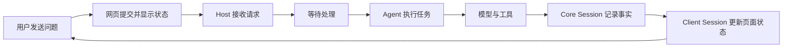

# 从网页输入到 Agent 回复

[English](web-session-flow.md) | 中文

用户在网页输入“请分析这个项目”并点击发送后，希望得到的体验很简单：消息确实送达；系统忙时不会丢；分析过程逐步可见；需要读文件或运行命令时仍然属于同一项任务；刷新页面后还能继续查看。

本文先沿着这些用户需求解释完整流程，再介绍代码中的名称和入口。第一次阅读可以只看“用户看到什么”和“系统怎样保证”；准备读代码时，再看每节末尾的“代码中的名称”。插件模型与包分工见 [architecture.md](architecture.zh.md)，精确事件语义见 [Sessions](subsystems/session.zh.md) 和 [Agent 生命周期](agent-lifecycle.zh.md)。

## 先看用户经历的完整过程

1. 用户输入问题并点击发送。发送成功后输入框清空；发送失败时，页面显示错误提示，输入内容保留在输入框中。
2. 系统接收消息。若上一项任务还没结束，新消息先进入等待区，页面显示它正在排队。
3. 系统开始处理消息，页面把它加入正式对话，并显示任务正在执行。
4. 处理过程中，回复文字逐步出现；系统读文件、运行命令或调用其他工具时，页面显示相应状态。
5. 工具返回结果后，系统可以继续分析，直到给出最终回复。多次分析和工具操作仍显示为同一项用户任务。
6. 页面持续接收对话变化。即使短暂断线，也会在重连后补齐遗漏内容。
7. 刷新页面时，系统从保存的记录恢复对话，用户继续看到同一段历史。

## 从需求到对象：先拆开不同性质的状态

技术建模不是先发明 `Session`、Agent 等名词，再把需求塞进去。这里先判断每份状态的性质，再给它选择拥有者：

| 需要保存的状态 | 关键要求 | 建模结果 |
|---|---|---|
| 尚未发送或发送失败的输入 | 只属于当前浏览器，不能覆盖用户的新编辑 | 输入状态机 |
| 已接收但尚未执行的消息 | 有顺序，可编辑、取消或转入当前任务 | Agent inbox |
| 当前正在执行的工作 | 可取消，可能等待模型、工具或用户，不需要跨进程保留对象本身 | Agent |
| 用户眼中的一项任务 | 统一记录开始、完成、失败和取消 | Turn |
| 一次模型处理 | 记录一次请求、流式输出、工具调用和用量 | Step |
| 已经发生的对话事实 | 必须按序、可恢复，并成为模型历史的唯一来源 | Core `Session` 事件日志 |
| 页面正在显示的内容 | 可丢弃重建，只保留当前窗口和交互状态 | Client `Session` |
| 多个会话和服务之间的协调 | 处理网络、路由、权限、Workspace 和重连 | Host |

这些对象不是按代码文件数量拆分，而是按生命周期、可信度和数量关系拆分。例如，输入草稿只活在浏览器中；Agent 只在当前进程中执行；Core `Session` 中的事实需要持久恢复；一个 Host 则同时协调许多 Session。

下面逐项解释每个需求怎样导出这些对象和它们的行为。

## 需求一：点击发送后，要知道消息有没有送达

用户点击发送后，页面提交输入内容。发送成功后，输入框才会清空。发送失败时，输入框上方会短暂显示错误提示，例如“模型不可用”或“连接失败”，原来的输入仍留在输入框中，用户可以修改后再次发送。

请求等待期间，当前页面会把输入框设为只读，并保持已提交文字可见。状态机还会拒绝旧 attempt 延迟返回的异步结果，因此其他事件产生的较新状态不会被旧结算覆盖。

提交成功只表示系统已经接收消息，不表示模型已经开始回答。系统可能仍在处理上一项任务，因此页面需要区分“已接收”和“已开始”。

技术建模：这一需求由输入状态机、Client `Session` 和 Host 共同完成。

- 输入状态机保存草稿、附件、编辑信息和“正在提交”状态；成功后清空已提交内容，失败时保留草稿，并防止旧 attempt 的延迟结果覆盖较新状态。
- Client `Session` 发起 `session.prompt`，保存最近一次发送或停止错误，供页面显示错误提示。
- Host 校验请求并返回“已接收”或明确错误。每次提交的 `rpcId` 只是追踪编号，用来把后续正式记录关联到这次网页提交。

## 需求二：系统忙时，后续消息不能丢

用户可能在回答尚未完成时继续发送补充信息。系统先把这些消息放入等待区，并保留顺序；执行者到达合适的处理时点后，再取走一批消息开始工作。

因此，等待中的消息和对话历史不是一回事。等待中的消息仍可被调整或取消；开始处理后，它才成为对话中已经发生的事实。

技术建模：这一需求主要形成 Agent 和 inbox 两个对象。

- inbox 为每条待处理消息保存稳定标识、内容、来源和目标位置，并维护顺序。
- `followup()` 把消息放到下一项任务的队列；`steer()` 把补充指令放到当前任务下一次可接收的位置；`inject()` 放入上下文但不会单独唤醒执行。
- 排队中的消息可以编辑、移除、取消或转为 steering。每次变化都会产生队列快照供页面显示。
- Agent 在 Turn 开始或两个 Step 之间调用 `claim`，一次取走当前边界应处理的消息。取走后才写入正式对话记录。

| 页面状态 | 用户可以怎样理解 |
|---|---|
| 已接收 | 消息安全进入等待区 |
| 已开始 | 执行者已经接手消息并开始任务 |

## 需求三：一项任务可能需要多次模型分析

用户只提交了一项任务，例如“分析这个项目”。但系统可能需要先让模型决定查看哪些文件，读取文件后再让模型继续分析，最后才形成结论。

页面仍把整个过程显示为同一项任务：开始、进行中、完成、失败或取消都有统一状态。内部有多少次模型处理，不会变成多条用户任务。

技术建模：这一需求形成 Turn 和 Step 两层工作单元，它们不是独立会话，也不是单独保存的业务对象，而是 Core `Session` 事件日志中的有序区间。

- Turn 负责一项用户任务的总状态：开始、运行、完成、失败、达到输出上限或取消。
- Step 负责一次模型处理：领取本次输入、组装模型请求、接收流式输出、处理工具调用并记录用量。
- Agent 持有当前 Turn 的运行状态和取消信号，决定何时开始下一个 Step，或何时结束 Turn。
- 页面只需要用 Turn 显示“这项任务是否仍在运行”，无需把每个 Step 当成新任务。

## 需求四：调用工具时，对话不能断开

模型只能生成请求，真正读取文件、运行命令或访问其他能力需要工具完成。系统记录工具何时开始、参数是什么、结果是什么，再把结果交回模型继续分析。

例如“分析项目”可能经历：

1. 模型判断需要查看哪些文件。
2. 工具读取项目内容。
3. 模型根据读取结果生成结论。

页面把工具状态和回复放在同一项任务中。若工具需要用户批准，任务会暂停等待；用户作出决定后，原任务继续，而不是重新开始一段对话。

技术建模：工具不是 Session 或 Agent 的内置分支，而是 Agent loop 使用的独立能力。

- Step 从模型输出中识别工具请求，并通过工具注册表查找对应实现。
- 工具执行管线负责参数、权限和策略检查，决定直接执行、拒绝还是等待用户批准。
- `tool/call` 在执行前记录调用，`tool/result` 记录成功或失败结果；并行安全的调用可以并发，互斥调用形成执行屏障。
- Agent 根据工具结果判断是否开启下一 Step；需要审批或提问时，当前 Step 保持等待，稳定标识允许页面在重连后继续响应。

## 需求五：回复要逐步显示，而且顺序不能乱

模型产生一小段文字，页面就应尽快显示，不必等待整篇回复完成。工具开始、工具结束和任务完成也要按实际发生顺序出现。

系统不会让执行者直接操作网页。每发生一件事，服务端先把它加入同一份有序记录，再把新增内容推送给浏览器。浏览器按编号接收、去重并整理为消息、工具卡片和运行状态。

这样，模型下一次使用的历史、页面显示的历史和刷新后恢复的历史都来自同一份记录，不会各自维护一套互相冲突的内容。

如果用户需要检查这些记录如何被整理为 Turn、Request、Assistant、Tool 和时间区间，以及时间线、搜索、折叠和详情面板如何实现，见 [Web 轨迹视图](web-trajectory-view.zh.md)。

技术建模：这一需求形成 Core `Session`、事件桥接和 Client `Session` 三层。

- Core `Session` 为每个事件分配递增序号，保存用户消息、模型分片、最终回复、工具过程和 Turn/Step 边界，并从事件派生下一次模型请求的消息历史。
- Host 订阅新增事件，把它们复用到浏览器连接；它只负责转发和访问控制，不重新解释对话内容。
- Client `Session` 保存一段连续的历史窗口，支持向前翻页，按序号去重并修复缺口；它还维护队列、待审批/提问和其他页面投影。
- `ConversationNodeAssembler` 把事件折叠为消息、工具卡片和状态节点。React 只渲染这些节点，不读取 Agent 内部状态。

## 需求六：刷新或断线后，还要回到同一段对话

浏览器只保存当前页面需要的内容，刷新后可以全部重建。页面重新连接服务端时，会先取得最近的历史，再继续接收实时变化；短暂断线造成的缺口也会按事件编号补齐。

服务端保存对话中已经发生的事实。恢复时，它从这些事实重建对话，并创建新的执行者。用户仍然处于同一个对话身份，页面状态和执行对象可以更换。

技术建模：恢复依赖四个不同生命周期的对象。

- `SessionId` 是对话身份，刷新、断线和进程重启都不改变它。
- 持久化插件观察 Core `Session` 事件，并在 flush 检查点写入存储；Core `Session` 本身不绑定某种数据库。
- 恢复时，SessionStore 用已保存事件重建 Core `Session`，Agent 工厂再为同一 `SessionId` 创建新的 Agent。
- Client `Session` 拉取最近一页历史，再接收实时事件；连接控制器用新的连接代次隔离旧连接，并根据事件序号补齐缺口。

## 再看一次完整链路

理解用户需求后，可以把一次消息对应到系统角色：

| 用户关心的事情 | 负责部分 |
|---|---|
| 输入、消息和工具卡片 | Conversation UI |
| 当前页面需要的历史、队列和等待操作 | Client `Session` |
| 接收网页请求并找到对应对话 | Host |
| 保存可恢复的对话事实 | Core `Session` |
| 驱动当前任务 | Agent |
| 生成内容或执行具体操作 | 模型与工具 |

## 对象职责卡

下面集中说明这些建模对象内部具体包含什么功能。这里列的是本页主链路需要的职责，不代替各子系统的完整 API 参考。

### 输入状态机

- 持有文本草稿、附件、引用标记、编辑信息和提交阶段；
- 区分普通消息、`/` 命令和其他输入触发器；
- 提交期间防止重复处理同一次尝试；
- 成功后清除已提交内容，并拒绝旧 attempt 的异步结算；
- 失败时保留草稿并产生页面错误提示。

用户需求、状态转换、抽象分层、失败行为和具体源码位置见 [Web 输入状态机](web-input-state-machine.zh.md)。状态机接收文本框传入的编辑选区；DOM 光标本身仍由 UI 管理。

### Client Session

- 持有当前打开会话的一段连续历史窗口和起始事件序号；
- 拉取更早历史，把实时事件追加到窗口尾部；
- 对事件去重、检测缺口，并在重连后修复；
- 保存 Agent 队列的页面状态；
- 保存待审批、待回答问题和后台任务状态；
- 对外提供发送、停止、翻页、队列调整和附件读取等操作；
- 向 Conversation UI 提供可订阅的页面快照。

Client `Session` 不保存完整权威历史，也不执行模型或工具。

### Host

- 提供 HTTP 请求入口和 WebSocket 事件下行；
- 根据 `SessionId` 定位或恢复 Session 和 Agent；
- 校验请求来源、会话可见性、附件、模型能力和必要配置；
- 协调 Workspace、Session 列表、Agent preset、设置、凭据和目录选择等服务；
- 把 Session、Agent 和其他能力的变化转换成客户端事件；
- 在浏览器重连时提供会话、队列和待交互基线。

Host 不拥有对话事实，也不运行模型循环。

浏览器 HTTP 请求、WebSocket 下行、Host 接纳与模型 provider 请求的准确分界见 [Web 请求链路与执行模型](web-request-execution-model.zh.md)。

### Core Session

- 持有 `SessionId`、创建信息和仅追加事件日志；
- 为事件分配严格递增的序号，并冻结已接受的数据；
- 记录 Turn、Step、用户消息、模型输出和工具过程；
- 从事件日志派生模型可见的消息历史；
- 提供只读事件视图、表面投影和 fork 所需的历史前缀；
- 广播追加、创建、销毁和 flush 检查点，供持久化和 UI 桥接插件观察；
- 从种子事件重建已有或分叉的对话。

Core `Session` 不接收 HTTP，不管理 Workspace，也不决定下一步执行什么。

### Agent

- 绑定一个 Core `Session`，持有 inbox 和当前执行状态；
- 接收 follow-up、steering 和注入上下文；
- 唤醒或保持执行循环，并在处理边界 `claim` 消息；
- 持有当前取消信号，处理停止和销毁；
- 暴露运行状态和 inbox 变化，供 Host 与插件观察；
- 使用当前 Agent 作用域中的模型、工具、提示词和策略。

Agent 是活跃执行对象，不是持久对话记录。

### Turn

- 表示一项用户任务从开始到结束的范围；
- 统一承载完成、错误、取消和输出上限等结束原因；
- 包含零个或多个 Step；
- 在结束前持续接收工具结果或 steering 后续工作。

### Step

- 在边界领取本次需要处理的消息；
- 从 Session 历史组装模型输入、系统提示词和工具 schema；
- 发起一次模型流并记录输出分片与最终消息；
- 解析、调度和等待这一轮产生的工具调用；
- 记录用量和结束状态，并决定是否需要下一 Step。

### SessionStore 与持久化插件

- SessionStore 创建、查找、列出和 fork 进程内 Core `Session`；
- 持久化插件订阅 Session 事件并写入具体存储；
- flush 是“此前事件已经完成持久化观察”的检查点；
- 恢复时，持久化提供方读取事件，Agent 工厂据此重建 Session 与 Agent。

这种拆分让 Core `Session` 不需要知道使用 JSONL、SQLite 或其他存储。

## 为什么不让 Core Session 直接承担 Host

你的直觉在“调用入口”这一层是对的：如果只看一次对话，`Session` 完全可以提供“发送消息、读取历史、停止任务”这些方法。但这会把两个不同范围的职责放进同一个对象。

Core `Session` 代表一段对话，回答的是“这段对话已经发生了什么”。它保存有序事件，供模型历史、页面显示、持久化和恢复使用；它本身不负责网络请求，也不负责启动 Agent 或选择 Workspace。它甚至是一个普通类，而不是承载整个运行环境的服务。

Host 代表一次运行中的服务端环境，回答的是“这次网页请求应该交给谁”。一个 Host 会同时管理很多 Session，还要连接 WebSocket、API、Workspace、Agent、权限、设置和持久化。它需要先根据 `SessionId` 找到 Session，再检查调用者和当前能力，最后把请求交给对应的 Agent。

如果把 Host 的功能放进 Session，会产生三个问题：

1. 每个 Session 都要重复持有网络、Workspace 和全局服务；
2. Core Session 会被迫依赖 Web/API，无法在 headless、测试或其他接入方式中单独复用；
3. 一个需要同时协调多个 Session 的动作（例如会话列表、Workspace 切换、广播事件和重连恢复）没有合适的拥有者。

所以这里不是“Session 不够强”，而是边界不同：Session 是一个对话记录，Host 是包含许多对话和能力的运行环境。Host 可以为 Session 提供操作入口，但 Session 不应反过来拥有 Host。

代码中的名称：Core `Session` 位于 [`packages/core/session`](../packages/core/session/README.zh.md)；Host 的网页 API 和事件桥接位于 [`packages/host/apiproxy`](../packages/host/apiproxy/README.md)。`dsh --profile headless` 可以直接使用 Core 能力而不挂载 Web API，正好说明这两层可以独立组合。

## 常见操作怎样改变主流程

| 用户操作 | 用户看到的结果 | 系统怎样处理 |
|---|---|---|
| 忙碌时继续发送 | 消息进入等待区 | 留在 inbox，等待下一 Turn 或当前 Turn 的下一 Step |
| 中途补充指令 | 当前任务采纳新要求 | steering 把指令送到当前执行可接收的位置 |
| 点击停止 | 当前任务停止，已有内容保留 | 清理尚未 `claim` 的消息，中断模型和工具，Turn 以 `aborted` 结束 |
| 批准工具操作 | 原任务继续 | 当前 Step 解除等待并继续同一 Turn |
| 从历史位置分叉 | 原对话保留，同时出现新对话 | 创建新的 fork Session |
| 委派独立任务 | 出现独立、可检查的任务记录 | 通常创建 subagent Session |

## 按用户路径阅读代码

| 用户路径 | 主要代码 | 阅读重点 |
|---|---|---|
| 输入和提交 | [`packages/client/ui-conversation`](../packages/client/ui-conversation/README.zh.md) | 输入状态、失败恢复、普通输入与 `/` 命令分流 |
| 页面会话状态 | [`packages/client/runtime/src/client/sessions`](../packages/client/runtime/src/client/sessions) | `prompt()`、历史窗口、队列状态和事件去重 |
| 服务端接收请求 | [`packages/host/apiproxy`](../packages/host/apiproxy/README.md) | `session.prompt` 如何定位 Session 和 Agent |
| 消息等待与接手 | [`packages/core/agent/src/inbox.ts`](../packages/core/agent/src/inbox.ts) | 消息如何排队并被 `claim` |
| 模型与工具循环 | [`packages/core/agent-loop/src/agent.ts`](../packages/core/agent-loop/src/agent.ts) | Turn、Step 和工具结果如何衔接 |
| 对话事实与恢复 | [`packages/core/session`](../packages/core/session/README.zh.md) | 事件如何追加、派生和恢复 |
| 浏览器断线重连 | [`packages/client/connection`](../packages/client/connection/README.zh.md) | 连接代次与缺口修复 |

具体机制分别见 [LLM streaming](subsystems/llm-streaming.zh.md)、[Tool execution pipeline](tool-execution-pipeline.zh.md)、[Persistence](subsystems/persistence.zh.md) 和 [Web Client](subsystems/web.zh.md)。
